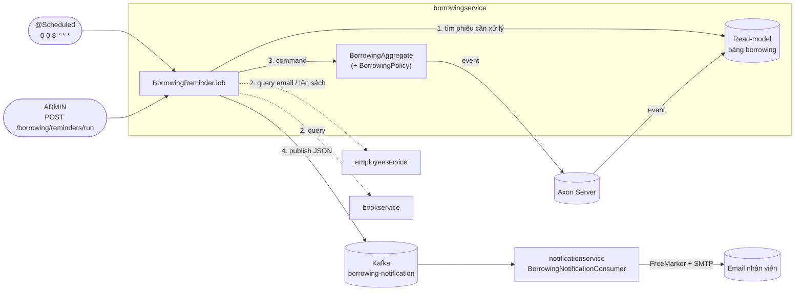
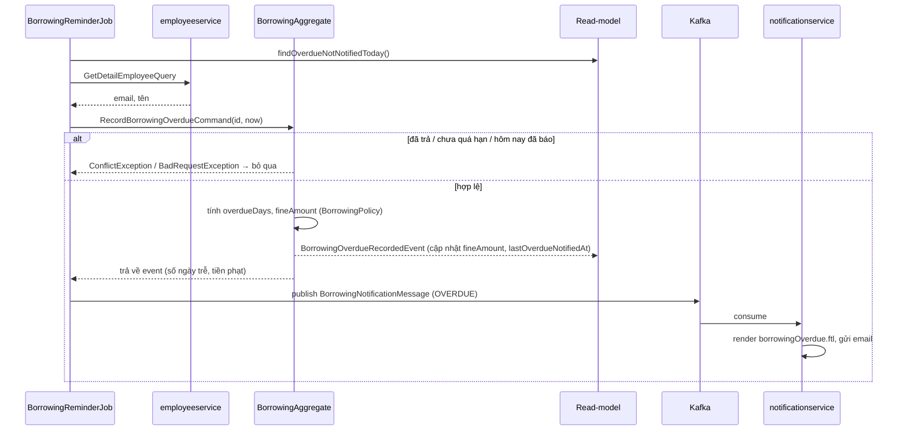

# Hạn trả, quá hạn và tiền phạt (Borrowing Reminder)

Tài liệu mô tả tính năng quản lý hạn trả sách trong hệ thống Library Management. Nội dung gồm luật nghiệp vụ, cách cronjob xử lý, luồng gửi email, cấu hình, cách chạy và cách kiểm thử.

> Đọc kèm [PROJECT_OVERVIEW.md](PROJECT_OVERVIEW.md) để nắm kiến trúc tổng thể và [RBAC.md](RBAC.md) để nắm phần phân quyền.

## 1. Tóm tắt

| | |
|---|---|
| **Mục tiêu** | Mỗi phiếu mượn có hạn trả. Hệ thống tự nhắc trước khi đến hạn, báo khi quá hạn và tính tiền phạt |
| **Nơi chạy cronjob** | `borrowingservice` (`@Scheduled`), mặc định 8h sáng mỗi ngày |
| **Nơi gửi email** | `notificationservice`, nhận message qua Kafka topic `borrowing-notification` |
| **Nơi lưu trạng thái** | Event trong Axon Server (nguồn sự thật) + read-model bảng `borrowing` |
| **Chống gửi trùng** | Aggregate quyết định: nhắc sắp đến hạn **1 lần**, báo quá hạn **tối đa 1 lần/ngày** |
| **Tiền phạt** | `fine-per-day × số ngày trễ`, tạm tính mỗi ngày, **chốt** khi trả sách |

## 2. Kiến trúc



## 3. Luật nghiệp vụ

Tất cả các luật nằm trong [BorrowingPolicy.java](borrowingservice/src/main/java/com/javamicroservices/borrowingservice/configuration/BorrowingPolicy.java). Mọi phép so sánh đều tính theo **ngày lịch**, không tính theo giờ.

| Luật | Cách tính | Mặc định |
|---|---|---|
| Hạn trả | `dueDate = borrowingDate + loan-days` (gán lúc tạo phiếu) | 14 ngày |
| Sắp đến hạn | Hạn trả rơi vào hôm nay hoặc `reminder-days-before` ngày tới | 2 ngày |
| Quá hạn | Hạn trả là một ngày **trước hôm nay** (trả trong ngày hạn thì chưa trễ) | |
| Số ngày trễ | Số ngày lịch từ ngày hạn trả tới ngày kiểm tra/ngày trả | |
| Tiền phạt | `fine-per-day × số ngày trễ` | 5.000 VND/ngày |

**Ví dụ**: mượn lúc 10h ngày 01/09, hạn trả là 10h ngày 15/09.

| Thời điểm cronjob chạy | Kết quả |
|---|---|
| 12/09 08:00 | Chưa làm gì (hạn trả còn 3 ngày) |
| 13/09 08:00 | Gửi email **nhắc sắp đến hạn** |
| 14/09, 15/09 08:00 | Không gửi (đã nhắc rồi, chưa quá hạn) |
| 16/09 08:00 | Gửi email **quá hạn 1 ngày, phạt 5.000 VND** |
| 18/09 08:00 | Gửi email **quá hạn 3 ngày, phạt 15.000 VND** |
| Trả sách ngày 18/09 | Tiền phạt được chốt là 15.000 VND, sau đó không gửi email nữa |

## 4. Cách xử lý chi tiết

### 4.1. Cronjob `BorrowingReminderJob`

File: [BorrowingReminderJob.java](borrowingservice/src/main/java/com/javamicroservices/borrowingservice/scheduler/BorrowingReminderJob.java)

Mỗi lần chạy, job thực hiện:

1. **Lấy danh sách phiếu từ read-model** ([BorrowingRepository.java](borrowingservice/src/main/java/com/javamicroservices/borrowingservice/command/data/BorrowingRepository.java)):
   - `findDueSoon(from, to)`: chưa trả, `dueSoonNotified = false`, hạn trả trong khoảng `[00:00 hôm nay, 00:00 của (hôm nay + reminder-days-before + 1))`.
   - `findOverdueNotNotifiedToday(startOfToday)`: chưa trả, hạn trả `< 00:00 hôm nay`, và hôm nay chưa được báo (`lastOverdueNotifiedAt` rỗng hoặc trước hôm nay).
2. **Với từng phiếu:**
   1. Query `GetDetailEmployeeQuery` để lấy email và tên nhân viên. Nếu nhân viên **không có email** thì bỏ qua phiếu đó và **không** đánh dấu đã gửi, để khi bổ sung email thì lần chạy sau vẫn gửi được.
   2. Gửi command vào aggregate: `NotifyBorrowingDueSoonCommand` hoặc `RecordBorrowingOverdueCommand`.
   3. Nếu aggregate chấp nhận, publish message JSON lên Kafka. Nếu aggregate từ chối (đã gửi, đã trả…) thì ghi log và bỏ qua.
3. Trả về `ReminderJobResult { dueSoonSent, overdueSent, skipped }`.

Lỗi của một phiếu không làm dừng cả job: mỗi phiếu được bọc `try/catch` riêng. Hàm `run()` là `synchronized`, nên lịch chạy tự động và lần ADMIN bấm chạy thủ công không chạy chồng lên nhau.

### 4.2. Tại sao phải gửi command vào aggregate?

Có thể cập nhật thẳng các cờ trong read-model, nhưng làm vậy sẽ phá vỡ CQRS và gặp 2 vấn đề:

- **Mất khi replay:** read-model H2 được dựng lại từ event mỗi khi restart. Cờ nào không đi kèm event sẽ mất, và email sẽ bị gửi lại.
- **Gửi trùng khi chạy nhiều instance:** 2 instance cùng đọc read-model sẽ cùng gửi email.

Khi đi qua aggregate, Axon xử lý command lần lượt trên từng aggregate. Instance thứ hai sẽ nhận `ConflictException` và không publish. Việc đã nhắc và số tiền phạt từng ngày cũng được lưu lại thành event, dùng được cho audit.



### 4.3. Kiểm tra trong aggregate

File: [BorrowingAggregate.java](borrowingservice/src/main/java/com/javamicroservices/borrowingservice/command/aggregate/BorrowingAggregate.java)

| Command | Từ chối khi | Event phát ra |
|---|---|---|
| `NotifyBorrowingDueSoonCommand` | Đã trả sách (409), hoặc đã nhắc rồi (409) | `BorrowingDueSoonNotifiedEvent` |
| `RecordBorrowingOverdueCommand` | Đã trả sách (409), chưa quá hạn (400), hoặc hôm nay đã ghi nhận (409) | `BorrowingOverdueRecordedEvent(overdueDays, fineAmount, recordedAt)` |
| `ReturnBorrowingCommand` | *(giữ luật cũ)* | `BorrowingReturedEvent` có thêm `fineAmount` đã chốt |
| `UpdateBorrowingCommand` | Hạn trả mới trước ngày mượn (400) | `BorrowingUpdatedEvent` có thêm `dueDate`. Không truyền `dueDate` thì giữ hạn cũ. Đổi hạn thì reset trạng thái "đã nhắc" |

Command handler nhận `BorrowingPolicy` qua tham số, ví dụ `handle(RecordBorrowingOverdueCommand command, BorrowingPolicy policy)`. Axon tự inject Spring bean vào tham số của handler, nhờ vậy aggregate không cần giữ tham chiếu tới bean (aggregate được dựng lại từ event, không phải Spring bean).

### 4.4. Read-model

Bảng `borrowing` ([Borrowing.java](borrowingservice/src/main/java/com/javamicroservices/borrowingservice/command/data/Borrowing.java)) có thêm các cột:

| Cột | Ý nghĩa |
|---|---|
| `dueDate` | Hạn trả |
| `fineAmount` | Tiền phạt: tạm tính mỗi lần ghi nhận quá hạn, chốt khi trả |
| `dueSoonNotified` | Đã gửi email nhắc sắp đến hạn chưa |
| `lastOverdueNotifiedAt` | Lần gần nhất gửi email quá hạn |

Có thêm index `(return_date, due_date)` phục vụ query của cronjob. Các cột này được cập nhật **chỉ từ event** trong [BorrowingEventsHandler.java](borrowingservice/src/main/java/com/javamicroservices/borrowingservice/command/event/BorrowingEventsHandler.java).

### 4.5. Message Kafka

Class dùng chung: [BorrowingNotificationMessage.java](commonservice/src/main/java/com/javamicroservices/commonservice/model/BorrowingNotificationMessage.java). Message được serialize bằng Jackson 3 (`JsonMapper`) vì `KafkaTemplate` đang dùng kiểu `<String, String>`.

```json
{
  "type": "OVERDUE",
  "borrowingId": "7c1e…",
  "recipientEmail": "member@example.com",
  "employeeName": "Nguyen Van A",
  "bookId": "b1",
  "bookName": "Clean Architecture",
  "borrowingDate": "01/09/2026",
  "dueDate": "15/09/2026",
  "overdueDays": 3,
  "fineAmount": 15000,
  "finePerDay": 5000,
  "currency": "VND"
}
```

`type` có 2 giá trị là `DUE_SOON` và `OVERDUE`. Ngày được format sẵn theo `dd/MM/yyyy`, để template dùng trực tiếp.

### 4.6. notificationservice

File: [BorrowingNotificationConsumer.java](notificationservice/src/main/java/com/javamicroservices/notificationservice/event/BorrowingNotificationConsumer.java)

- Lắng nghe topic `borrowing-notification`. `type` quyết định template được dùng:
  - `DUE_SOON` dùng [borrowingDueSoon.ftl](notificationservice/src/main/resources/templates/borrowingDueSoon.ftl).
  - `OVERDUE` dùng [borrowingOverdue.ftl](notificationservice/src/main/resources/templates/borrowingOverdue.ftl): số ngày trễ, phí mỗi ngày, tiền phạt tạm tính.
- Dùng `@RetryableTopic`: retry 3 lần (backoff 1s, 2s, 4s), sau đó chuyển vào DLT. Message **sai format JSON** (`JacksonException`) thì không retry mà vào thẳng DLT, vì có retry cũng không thành công.

## 5. API thay đổi

| Method | Path | Quyền | Thay đổi |
|---|---|---|---|
| POST | `/api/v1/borrowing` | như cũ | Tự gán `dueDate = hôm nay + loan-days` |
| PATCH | `/api/v1/borrowing/{id}` | LIBRARIAN, ADMIN | Nhận thêm `dueDate` để **gia hạn**. Bỏ trống thì giữ hạn cũ |
| PATCH | `/api/v1/borrowing/{id}/return` | như cũ | Chốt `fineAmount` nếu trả muộn |
| GET | `/api/v1/borrowing/employeeId/{employeeId}` | như cũ | Response có thêm `dueDate`, `fineAmount` |
| POST | `/api/v1/borrowing/reminders/run` | **ADMIN** | **Mới**: chạy cronjob ngay, trả về số email đã gửi và số phiếu bỏ qua |
| POST / PUT | `/api/v1/employees` | ADMIN | Nhận thêm `email` (không bắt buộc, có validate format) |

Ví dụ response của `POST /api/v1/borrowing/reminders/run`:

```json
{
  "statusCode": 200,
  "message": "Borrowing reminder job executed",
  "data": { "dueSoonSent": 1, "overdueSent": 2, "skipped": 0 }
}
```

## 6. Cấu hình

Trong `borrowingservice/src/main/resources/application.properties`:

```properties
# Kafka
spring.kafka.bootstrap-servers=${KAFKA_BOOTSTRAP_SERVERS:localhost:9092}
spring.kafka.consumer.group-id=${KAFKA_GROUP_ID:borrowingservice}

# Luật mượn sách
borrowing.policy.loan-days=14
borrowing.policy.reminder-days-before=2
borrowing.policy.fine-per-day=5000
borrowing.policy.currency=VND

# Lịch cronjob (giây phút giờ ngày tháng thứ). "-" để tắt
borrowing.reminder.cron=0 0 8 * * *
```

- Khi dev, có thể đặt `borrowing.reminder.cron=0 */1 * * * *` để job chạy mỗi phút. Nhờ có kiểm tra trong aggregate, chạy dày cũng không bị gửi trùng.
- Múi giờ dùng để tính "ngày" là múi giờ của JVM (`ZoneId.systemDefault()`). Khi chạy trong Docker nên đặt `TZ=Asia/Ho_Chi_Minh`.

## 7. Cách chạy

```bash
# 1. Hạ tầng: Keycloak, Axon Server, Kafka, Redis
docker compose -f docker-compose-provider.yml up -d
docker compose -f docker-compose.yml up -d

# 2. BẮT BUỘC: cài lại commonservice (có BorrowingNotificationMessage, EmployeeResponseCommonModel.email)
cd commonservice && ./mvnw clean install -DskipTests && cd ..

# 3. Chạy các service liên quan (discoverserver chạy trước)
cd discoverserver      && ./mvnw spring-boot:run
cd apigateway          && ./mvnw spring-boot:run
cd bookservice         && ./mvnw spring-boot:run
cd employeeservice     && ./mvnw spring-boot:run
cd borrowingservice    && ./mvnw spring-boot:run
cd notificationservice && ./mvnw spring-boot:run
```

`notificationservice` cần cấu hình SMTP hợp lệ (`spring.mail.*`) thì mới gửi được email.

## 8. Kiểm thử

### 8.1. Unit test

```bash
cd borrowingservice    && ./mvnw test -Dtest='BorrowingPolicyTest,BorrowingAggregateTest'
cd notificationservice && ./mvnw test -Dtest='BorrowingNotificationTemplateTest'
```

| Test | Nội dung |
|---|---|
| `BorrowingPolicyTest` | Tính hạn trả, số ngày trễ theo ngày lịch, tiền phạt, `startOfDay` |
| `BorrowingAggregateTest` | Dùng `AggregateTestFixture` (thư viện `axon-test`). Kiểm tra: tạo phiếu có `dueDate`; trả muộn chốt tiền phạt; nhắc chỉ 1 lần; không nhắc sau khi đã trả; gia hạn thì được nhắc lại; quá hạn mỗi ngày 1 lần; từ chối khi chưa quá hạn |
| `BorrowingNotificationTemplateTest` | JSON round-trip của message; render 2 template FreeMarker với dữ liệu thật |

> `BorrowingserviceApplicationTests` (context test mặc định) cần Axon Server và Keycloak đang chạy, nên các lệnh trên chỉ chạy những test cụ thể.

### 8.2. Kiểm thử thủ công (end-to-end)

Không cần đợi 14 ngày: chỉ cần lùi hạn trả về quá khứ rồi chạy job bằng tay.

```bash
# 1. ADMIN tạo nhân viên có email
curl -X POST http://localhost:8080/api/v1/employees \
  -H "Authorization: Bearer $ADMIN_TOKEN" -H "Content-Type: application/json" \
  -d '{"firstName":"Van A","lastName":"Nguyen","kin":"IT","email":"you@example.com"}'

# 2. Tạo phiếu mượn -> lấy borrowingId
curl -X POST http://localhost:8080/api/v1/borrowing \
  -H "Authorization: Bearer $LIBRARIAN_TOKEN" -H "Content-Type: application/json" \
  -d '{"bookId":"<bookId>","employeeId":"<employeeId>"}'

# 3. Lùi hạn trả về 3 ngày trước (giữ nguyên borrowingDate lấy từ GET, nếu không sẽ bị ghi đè thành null)
curl -X PATCH http://localhost:8080/api/v1/borrowing/<borrowingId> \
  -H "Authorization: Bearer $LIBRARIAN_TOKEN" -H "Content-Type: application/json" \
  -d '{"bookId":"<bookId>","employeeId":"<employeeId>","borrowingDate":"2026-09-01T03:00:00.000Z","dueDate":"2026-09-27T03:00:00.000Z"}'

# 4. Chạy job ngay
curl -X POST http://localhost:8080/api/v1/borrowing/reminders/run -H "Authorization: Bearer $ADMIN_TOKEN"
```

| Kịch bản | Kết quả mong đợi |
|---|---|
| Hạn trả là ngày mai, chạy job | `dueSoonSent = 1`, nhận email nhắc hạn |
| Chạy job lần 2 cùng ngày | `dueSoonSent = 0` (đã nhắc) |
| Hạn trả là 3 ngày trước, chạy job | `overdueSent = 1`, email báo phạt 15.000 VND |
| Chạy job lần 2 cùng ngày | `overdueSent = 0` (hôm nay đã báo) |
| Nhân viên không có email | `skipped = 1`, log `employee … has no email` |
| Trả sách muộn 3 ngày | `GET /borrowing/employeeId/{id}` trả về `fineAmount = 15000` |
| MEMBER gọi `/reminders/run` | **403** |

## 9. Lưu ý và hạn chế

- **Phiếu mượn cũ không có hạn trả.** Các phiếu tạo trước khi có tính năng này có `dueDate = null` nên cronjob bỏ qua. Muốn áp dụng thì dùng `PATCH /borrowing/{id}` để đặt `dueDate`.
- **Nhân viên cũ chưa có email.** Cần `PUT /employees/{id}` để bổ sung. Lưu ý `PUT` ghi đè toàn bộ, nên thiếu `email` trong body thì email sẽ bị xoá.
- **Mỗi thông báo gửi tối đa 1 lần (at-most-once).** Job ghi nhận vào aggregate trước rồi mới publish Kafka. Nếu Kafka lỗi ngay lúc đó, email nhắc sắp đến hạn sẽ mất; email quá hạn thì hôm sau vẫn gửi lại. Muốn chắc chắn gửi được (at-least-once) thì cần áp dụng outbox pattern.
- **Lỗi SMTP không được retry.** `EmailService` (có sẵn trong code) đang bắt và bỏ qua `MessagingException`, nên email gửi lỗi sẽ không đi vào retry topic hay DLT.
- **Chưa có luật tự động kỷ luật nhân viên** khi nợ phạt quá nhiều hoặc quá hạn quá lâu. Có thể bổ sung bằng cách phát `UpdateEmployeeCommand(isDisciplined = true)` khi `fineAmount` vượt ngưỡng; saga mượn sách sẵn có sẽ tự chặn các lần mượn tiếp theo.
- **Chưa có API thanh toán hoặc xoá nợ tiền phạt.**

## 10. Danh sách file thay đổi

**Mới**

| File | Mô tả |
|---|---|
| `borrowingservice/.../configuration/BorrowingPolicy.java` | Luật hạn trả, tiền phạt (cấu hình qua properties) |
| `borrowingservice/.../scheduler/BorrowingReminderJob.java` | Cronjob nhắc hạn / báo quá hạn |
| `borrowingservice/.../scheduler/ReminderJobResult.java` | Kết quả một lần chạy job |
| `borrowingservice/.../command/command/NotifyBorrowingDueSoonCommand.java` | Command ghi nhận đã nhắc |
| `borrowingservice/.../command/command/RecordBorrowingOverdueCommand.java` | Command ghi nhận quá hạn |
| `borrowingservice/.../command/event/BorrowingDueSoonNotifiedEvent.java` | Event đã nhắc |
| `borrowingservice/.../command/event/BorrowingOverdueRecordedEvent.java` | Event quá hạn + tiền phạt |
| `commonservice/.../model/BorrowingNotificationMessage.java` | Message Kafka dùng chung |
| `notificationservice/.../event/BorrowingNotificationConsumer.java` | Consumer gửi email |
| `notificationservice/.../templates/borrowingDueSoon.ftl`, `borrowingOverdue.ftl` | Template email |
| `borrowingservice/src/test/...` (`BorrowingPolicyTest`, `BorrowingAggregateTest`, `BorrowingPolicyTestSupport`) | Unit test |
| `notificationservice/src/test/.../BorrowingNotificationTemplateTest.java` | Test template + JSON |

**Sửa**

| File | Mô tả |
|---|---|
| `BorrowingAggregate` | State `dueDate`, `fineAmount`, `dueSoonNotified`, `lastOverdueNotifiedAt`; 2 command handler mới; chốt phạt khi trả; gia hạn |
| `Borrowing`, `BorrowingRepository` | Cột mới, index, 2 query cho cronjob |
| `BorrowingEventsHandler` | Cập nhật read-model từ event mới |
| `CreateBorrowingCommand`, `UpdateBorrowingCommand`, `BorrowingCreatedEvent`, `BorrowingUpdatedEvent`, `BorrowingReturedEvent` | Thêm `dueDate` / `fineAmount` |
| `BorrowingUpdateModel`, `BorrowingUpdateResponse`, `BorrowingResponseModel` | Thêm `dueDate` / `fineAmount` |
| `BorrowingCommandController` | Gán hạn trả khi tạo phiếu, endpoint `/reminders/run` |
| `BorrowingserviceApplication` | `@EnableScheduling`, `@Import` `KafkaConfig` + `KafkaService` |
| `borrowingservice/application.properties` | Cấu hình Kafka, policy, cron |
| `borrowingservice/pom.xml` | Thêm `axon-test` (scope test) |
| `employeeservice`: entity, command, event, aggregate, model, controller | Thêm `email` cho nhân viên |
| `commonservice/.../EmployeeResponseCommonModel.java` | Thêm `email` |
