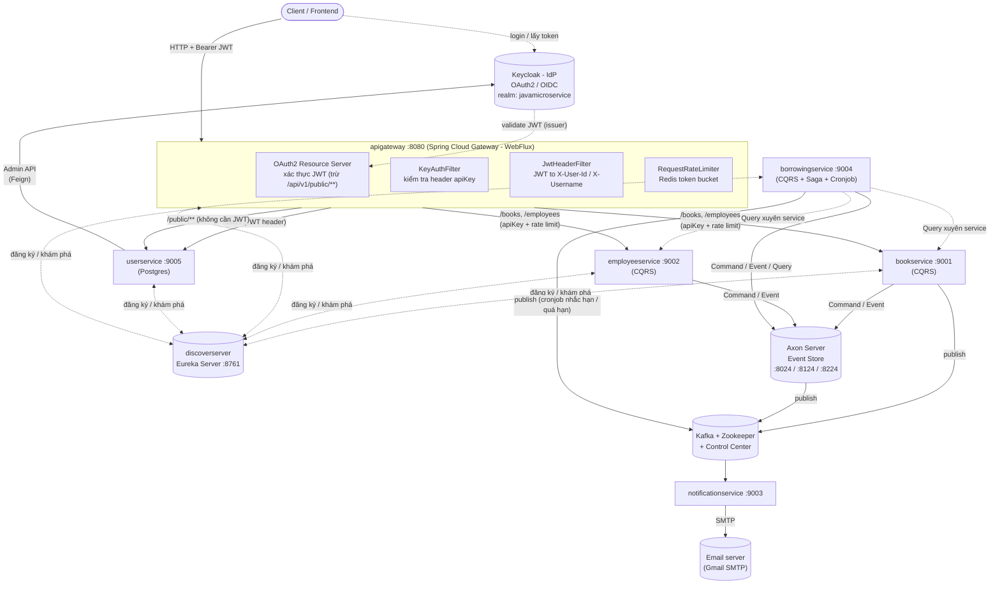
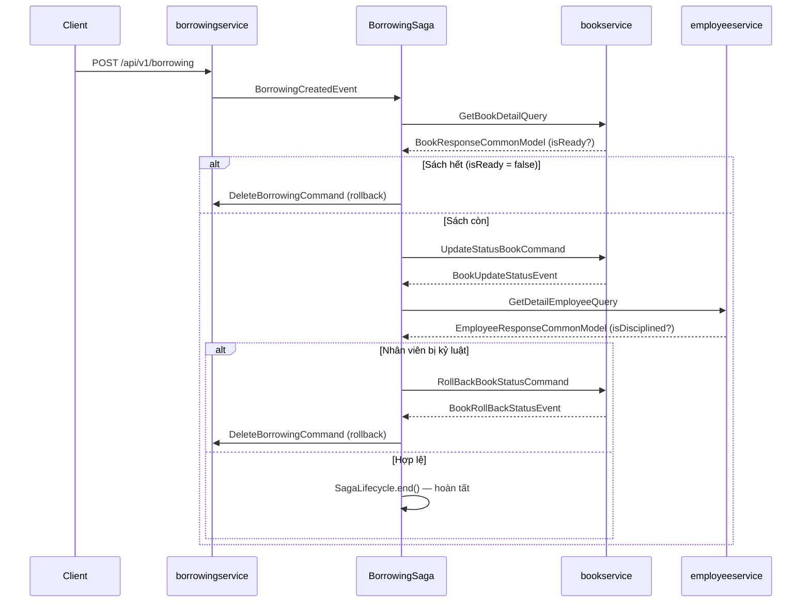

# Java Microservices — Hệ thống Quản lý Thư viện (Library Management)

## 0. Tóm tắt nhanh

| | |
|---|---|
| **Loại dự án** | Microservices Java, mô phỏng nghiệp vụ quản lý thư viện (mượn/trả sách) |
| **Ngôn ngữ / Runtime** | Java 17 |
| **Framework chính** | Spring Boot `4.1.1`, Spring Cloud `2025.1.3` |
| **Số lượng service** | 8 (7 service chạy độc lập + 1 thư viện dùng chung) |
| **Pattern kiến trúc nổi bật** | CQRS, Event Sourcing (Axon Framework), Saga (orchestration), API Gateway, Service Discovery |
| **Xác thực** | OAuth2 / OIDC qua Keycloak, JWT tại Gateway |
| **Message broker** | Apache Kafka (Confluent) |
| **Build / đóng gói** | Maven (Maven Wrapper), Docker, Docker Compose, Kubernetes (bản nháp) |
| **CI/CD** | GitHub Actions → build & push Docker image → SSH deploy lên VPS |

## 1. Tổng quan

Đây là một hệ thống **microservices** viết bằng Java/Spring Boot, mô phỏng nghiệp vụ **quản lý thư viện**: quản lý sách (`bookservice`), quản lý nhân viên (`employeeservice`), quản lý phiếu mượn sách (`borrowingservice`), quản lý người dùng/xác thực (`userservice`), gửi thông báo email (`notificationservice`), cùng các thành phần hạ tầng dùng chung: service discovery (`discoverserver`), API gateway (`apigateway`) và một thư viện dùng chung (`commonservice`).

Điểm đặc trưng của dự án là áp dụng **CQRS + Event Sourcing** (thông qua Axon Framework) và **Saga pattern** để xử lý giao dịch phân tán khi mượn sách (phải kiểm tra sách còn hay không, nhân viên có đang bị kỷ luật/khoá hay không, và rollback nếu có lỗi ở bất kỳ bước nào).

Mỗi phiếu mượn có **hạn trả**; một **cronjob** trong `borrowingservice` tự nhắc trước khi đến hạn, báo quá hạn và tính **tiền phạt**, rồi gửi email qua Kafka → `notificationservice` (chi tiết: [BORROWING_REMINDER.md](BORROWING_REMINDER.md)).

Xác thực/uỷ quyền được tách riêng qua **Keycloak** (OAuth2/OIDC), API Gateway đứng trước để định tuyến, xác thực JWT, giới hạn tốc độ (rate limit) và forward thông tin người dùng xuống các service phía sau.

Xét về mục đích, đây giống một dự án **học tập/thực hành kiến trúc microservices nâng cao** hơn là một sản phẩm production-ready: nó cố tình đưa vào gần như đầy đủ các "món" kinh điển của microservices (discovery, gateway, CQRS, event sourcing, saga, message queue với retry/DLQ, IdP riêng biệt) trên cùng một bài toán nghiệp vụ nhỏ (thư viện), rất phù hợp để đối chiếu lý thuyết với triển khai thực tế.

## 2. Kiến trúc tổng thể



> Sơ đồ trên chỉ mô tả các luồng chính; một vài quan hệ phụ (health-check, Eureka self-preservation…) được lược bỏ cho dễ đọc.

`commonservice` **không phải** là một service chạy độc lập mà là **thư viện dùng chung** (shared library, được các service khác `import` như một Maven dependency): chứa exception chuẩn, `ApiResponse` wrapper, cấu hình Axon/Kafka/Mail, và các command/event/query dùng để giao tiếp chéo giữa `bookservice` ↔ `borrowingservice` ↔ `employeeservice` trong saga.

## 3. Danh sách services

| Service | Cổng | Vai trò | DB | Ghi chú |
|---|---|---|---|---|
| `discoverserver` | 8761 | Service registry (Eureka Server) | — | Không tự đăng ký chính nó vào registry |
| `apigateway` | 8080 | API Gateway / BFF, xác thực, rate-limit | — (Redis) | Spring Cloud Gateway WebFlux |
| `bookservice` | 9001 | Quản lý sách (CQRS) | H2 in-memory (`bookDB`) | Aggregate: `BookAggregate` |
| `employeeservice` | 9002 | Quản lý nhân viên (CQRS) | H2 in-memory (`employeeDB`) | Có Swagger/OpenAPI |
| `notificationservice` | 9003 | Consumer Kafka, gửi email | — | Kafka consumer + Freemarker template (chào mừng, nhắc hạn trả, quá hạn/tiền phạt) |
| `borrowingservice` | 9004 | Quản lý phiếu mượn (CQRS + Saga) | H2 in-memory (`borrowingDB`) | Điều phối `BorrowingSaga`; cronjob `BorrowingReminderJob` nhắc hạn trả / tính tiền phạt |
| `userservice` | 9005 | Quản lý user, đăng nhập, tích hợp Keycloak | PostgreSQL (`library_local`) | Gọi Keycloak Admin API qua Feign |
| `commonservice` | — | Thư viện dùng chung (không chạy độc lập) | — | Exception, ApiResponse, Axon/Kafka/Mail config |

## 4. Công nghệ sử dụng

### Ngôn ngữ & nền tảng
- **Java 17**
- **Spring Boot** (parent `4.1.1`), **Spring Cloud** `2025.1.3`
- **Maven** (build tool, dùng Maven Wrapper `mvnw`)
- **Lombok** — giảm boilerplate

### Kiến trúc & giao tiếp
- **Spring Cloud Netflix Eureka** — service discovery (client & server)
- **Spring Cloud Gateway (WebFlux, reactive)** — API Gateway
- **OpenFeign** (`spring-cloud-starter-openfeign`) — `userservice` gọi Keycloak Admin REST API (`IdentityClient`)
- **Axon Framework** (`axon-spring-boot-starter` + **Axon Server**) — CQRS, Event Sourcing, Command/Query/Event Gateway, **Saga** (`BorrowingSaga`)
- **Apache Kafka** (Confluent images) + **Spring Kafka** — message broker cho luồng thông báo, có cấu hình **Retryable Topic + Dead Letter Topic (DLT)** với backoff
- **Redis** — backing store cho `RequestRateLimiter` (token bucket) của Gateway

### Bảo mật
- **Keycloak** (`quay.io/keycloak/keycloak:25.0.0`) — Identity Provider (OAuth2/OIDC), realm `javamicroservice`
- **Spring Security OAuth2 Resource Server** (JWT) tại `apigateway` — xác thực token phát hành bởi Keycloak
- Filter tuỳ biến tại Gateway:
  - `KeyAuthFilter` — kiểm tra header `apiKey` tĩnh cho route `/books`, `/employees`
  - `JwtHeaderFilter` — trích `sub`/`preferred_username` từ JWT, gắn vào header `X-User-Id` / `X-Username` khi forward xuống `userservice`
- `userservice` dùng Feign client gọi thẳng Keycloak Admin API để **tạo user**, **đổi token** (client-credentials & password grant)

### Dữ liệu
- **H2 (in-memory)** — DB tạm cho `bookservice`, `employeeservice`, `borrowingservice` (mỗi service một DB riêng, có bật H2 console)
- **PostgreSQL** — DB chính thức cho `userservice` (`library_local`)
- **Spring Data JPA** — ORM cho các service có DB quan hệ

### Nhắn tin & thông báo
- **Spring Kafka** — publish/consume sự kiện (topic `test`, `testEmail`, `emailTemplate`, `borrowing-notification`)
- **Spring Scheduling** (`@Scheduled`) — cronjob nhắc hạn trả / báo quá hạn trong `borrowingservice`
- **Spring Boot Starter Mail** + **FreeMarker** — soạn & gửi email (SMTP Gmail), có template `emailTemplate.ftl`

### Khác
- **Google Guava** — dùng ở các service CQRS
- **springdoc-openapi** — Swagger UI cho `employeeservice`
- **H2 Console** — debug DB dev

### Phiên bản image hạ tầng (theo `docker-compose.yml` / `docker-compose-provider.yml`)

| Thành phần | Image | Tag |
|---|---|---|
| Axon Server | `axoniq/axonserver` | `latest` |
| Redis | `redis` | `lastest` ⚠️ *(typo — xem mục 10)* |
| Zookeeper | `confluentinc/cp-zookeeper` | `7.7.0` |
| Kafka broker | `confluentinc/cp-server` | `7.7.0` |
| Kafka Control Center | `confluentinc/cp-enterprise-control-center` | `7.7.0` |
| Keycloak | `quay.io/keycloak/keycloak` | `25.0.0` |

## 5. Kiến trúc CQRS + Event Sourcing + Saga (điểm nhấn của dự án)

Các service nghiệp vụ chính (`bookservice`, `employeeservice`, `borrowingservice`) đều tách theo 2 luồng:

- **Command side** (`command/`): `Aggregate` (vd. `BookAggregate`) nhận `Command` → validate → phát ra `Event` → `AggregateLifecycle.apply(event)`. Aggregate tự cập nhật state qua `@EventSourcingHandler`.
- **Query side** (`query/`): `Projection` lắng nghe event để cập nhật read-model, `QueryController` phục vụ truy vấn qua `QueryGateway`.

Tất cả event được lưu tập trung ở **Axon Server** (event store), cho phép replay & tách biệt hoàn toàn ghi/đọc.

### Bảng Command / Event / Query dùng chung xuyên service (định nghĩa trong `commonservice`)

| Loại | Tên | Service phát ra | Service xử lý |
|---|---|---|---|
| Command | `UpdateStatusBookCommand` | `borrowingservice` (saga) | `bookservice` |
| Command | `RollBackBookStatusCommand` | `borrowingservice` (saga) | `bookservice` |
| Event | `BookUpdateStatusEvent` | `bookservice` | `borrowingservice` (saga) |
| Event | `BookRollBackStatusEvent` | `bookservice` | `borrowingservice` (saga) |
| Query | `GetBookDetailQuery` | `borrowingservice` (saga) | `bookservice` |
| Query | `GetDetailEmployeeQuery` | `borrowingservice` (saga) | `employeeservice` |

### Saga nghiệp vụ mượn sách (`BorrowingSaga` trong `borrowingservice`)



Diễn giải từng bước:

1. `BorrowingCreatedEvent` (tạo phiếu mượn) → saga gọi `GetBookDetailQuery` sang `bookservice` kiểm tra sách còn sẵn (`isReady`).
   - Nếu sách hết → gửi `DeleteBorrowingCommand` để rollback phiếu mượn.
   - Nếu còn → gửi `UpdateStatusBookCommand` để đánh dấu sách đã được mượn.
2. `BookUpdateStatusEvent` → saga gọi `GetDetailEmployeeQuery` sang `employeeservice` kiểm tra nhân viên có bị kỷ luật (`isDisciplined`) không.
   - Nếu bị khoá → gửi `RollBackBookStatusCommand` (trả sách về trạng thái sẵn sàng) **và** kết thúc bằng việc xoá phiếu mượn.
   - Nếu hợp lệ → `SagaLifecycle.end()`, hoàn tất giao dịch mượn sách.
3. `BookRollBackStatusEvent` → rollback bản ghi mượn (`DeleteBorrowingCommand`).
4. `BorrowingDeletedEvent` → `@EndSaga`, kết thúc saga.

Đây là ví dụ **compensating transaction** (Saga orchestration) điển hình cho giao dịch xuyên nhiều service không dùng distributed transaction/2PC: thay vì khoá tài nguyên trên nhiều service cùng lúc, hệ thống chấp nhận trạng thái "tạm thời không nhất quán" rồi tự sửa (rollback) bằng một chuỗi command bù trừ nếu bước sau thất bại.

### Hạn trả, quá hạn và tiền phạt (cronjob)

Tài liệu đầy đủ: [BORROWING_REMINDER.md](BORROWING_REMINDER.md).

- Khi tạo phiếu, `dueDate = ngày mượn + 14 ngày` (cấu hình `borrowing.policy.*`).
- `BorrowingReminderJob` (`@Scheduled`, mặc định 8h sáng) quét read-model:
  - **Sắp đến hạn** (trong 2 ngày tới) → `NotifyBorrowingDueSoonCommand` → nhắc **1 lần**.
  - **Quá hạn** → `RecordBorrowingOverdueCommand` → aggregate tính `số ngày trễ × 5.000 VND` → báo **tối đa 1 lần/ngày**.
- Aggregate quyết định có gửi hay không và lưu lại bằng event (`BorrowingDueSoonNotifiedEvent`, `BorrowingOverdueRecordedEvent`), nên chạy lại job hay chạy nhiều instance đều không gửi trùng. Chỉ khi command thành công, job mới publish `BorrowingNotificationMessage` (JSON) lên topic `borrowing-notification`.
- Tiền phạt được **chốt** trong `BorrowingReturedEvent` khi trả sách.
- `notificationservice` (`BorrowingNotificationConsumer`) render `borrowingDueSoon.ftl` / `borrowingOverdue.ftl` và gửi email tới `email` của nhân viên (trường mới của `employeeservice`). Có retry topic + DLT như các consumer khác.

## 6. Chuẩn hoá response & xử lý lỗi

- `commonservice.model.ApiResponse<T>` — wrapper JSON thống nhất cho toàn hệ thống: `statusCode`, `message`, `data` (khi thành công), `error` + `details` (khi lỗi), `timestamp`. Có factory method sẵn: `success()`, `created()`, `notFound()`, `badRequest()`, `conflict()`, `unauthorized()`, `forbidden()`, `error()`.
- `commonservice.advise.ExceptionAdvice` (`@ControllerAdvice`) — bắt lỗi tập trung: validation lỗi (`MethodArgumentNotValidException`), lỗi từ Axon (`HandlerExecutionException`, kèm `ErrorDetail` truyền HTTP status code cụ thể), lỗi bọc trong `CompletionException`/`ExecutionException` khi gọi `queryGateway.query().join()`, và exception nghiệp vụ tuỳ biến (`AppException` và các lớp con: `BadRequestException`, `NotFoundException`, `ConflictException`, `ForbiddenException`, `UnauthorizedException`).
- `userservice` có bộ exception & `GlobalExceptionHandler` riêng tương tự (chưa phụ thuộc `commonservice`).

Ví dụ response thành công:

```json
{
  "statusCode": 200,
  "message": "Get book detail successfully",
  "data": {
    "id": "b1",
    "name": "Clean Architecture",
    "author": "Robert C. Martin",
    "isReady": true
  }
}
```

Ví dụ response lỗi (validation):

```json
{
  "statusCode": 400,
  "message": "Validation failed",
  "error": "Bad Request",
  "details": [
    "name: must not be blank"
  ]
}
```

## 7. Danh sách API chính

| Method | Path | Service | Mô tả |
|---|---|---|---|
| POST | `/api/v1/books` | bookservice (command) | Tạo sách |
| PUT | `/api/v1/books/{bookId}` | bookservice (command) | Cập nhật sách |
| DELETE | `/api/v1/books/{bookId}` | bookservice (command) | Xoá sách |
| GET | `/api/v1/books` | bookservice (query) | Lấy danh sách sách |
| GET | `/api/v1/books/{bookId}` | bookservice (query) | Lấy chi tiết sách |
| POST | `/api/v1/books/sendMessage` | bookservice (query) | Test gửi message Kafka |
| POST | `/api/v1/employees` | employeeservice (command) | Tạo nhân viên (có `email` để nhận thông báo) |
| PUT | `/api/v1/employees/{employeeId}` | employeeservice (command) | Cập nhật nhân viên |
| DELETE | `/api/v1/employees/{employeeId}` | employeeservice (command) | Xoá nhân viên |
| GET | `/api/v1/employees?isDisciplined=` | employeeservice (query) | Lấy danh sách nhân viên, lọc theo trạng thái kỷ luật |
| GET | `/api/v1/employees/{employeeId}` | employeeservice (query) | Lấy chi tiết nhân viên |
| POST | `/api/v1/borrowing` | borrowingservice (command) | Tạo phiếu mượn sách (kích hoạt saga, tự gán hạn trả) |
| PATCH | `/api/v1/borrowing/{borrowingId}` | borrowingservice (command) | Sửa phiếu mượn / gia hạn (`dueDate`) |
| PATCH | `/api/v1/borrowing/{borrowingId}/return` | borrowingservice (command) | Trả sách (chốt tiền phạt nếu trả muộn) |
| GET | `/api/v1/borrowing/employeeId/{employeeId}` | borrowingservice (query) | Danh sách phiếu mượn của nhân viên (kèm `dueDate`, `fineAmount`) |
| POST | `/api/v1/borrowing/reminders/run` | borrowingservice (command) | ADMIN chạy ngay cronjob nhắc hạn / báo quá hạn |
| POST | `/api/v1/public/login` | userservice | Đăng nhập (không cần JWT, đi qua Keycloak) |
| POST | `/api/v1/users` | userservice | Tạo user (đăng ký, tạo cả trên Keycloak) |
| GET | `/api/v1/users` | userservice | Lấy danh sách user |
| GET | `/api/v1/users/{id}` | userservice | Lấy chi tiết user |
| PUT | `/api/v1/users/{id}` | userservice | Cập nhật user |
| DELETE | `/api/v1/users/{id}` | userservice | Xoá user |

Tất cả request qua `apigateway` (port `8080`) đều được route dựa trên path và (trừ `/api/v1/public/**`) yêu cầu JWT hợp lệ từ Keycloak; route `/books` và `/employees` còn yêu cầu thêm header `apiKey` hợp lệ và bị giới hạn tốc độ 10 req/s (burst 20) qua Redis.

## 8. Luồng nghiệp vụ end-to-end — ví dụ "mượn sách"

1. Client gọi `POST /api/v1/public/login` (qua gateway → `userservice` → Keycloak) để lấy `access_token`.
2. Client gọi `POST /api/v1/borrowing` kèm `Authorization: Bearer <token>` → gateway xác thực JWT, forward xuống `borrowingservice`.
3. `borrowingservice` tạo `Borrowing` aggregate, phát `BorrowingCreatedEvent` → lưu vào Axon Server.
4. `BorrowingSaga` bắt sự kiện, gọi lần lượt `bookservice` (kiểm tra sách) rồi `employeeservice` (kiểm tra nhân viên) như mô tả ở mục 5; nếu một trong hai điều kiện không thoả, saga tự rollback bằng command bù trừ.
5. Khi giao dịch thành công, một service (Book/Notification, tuỳ luồng thực tế) publish message lên Kafka (`testEmail` / `emailTemplate`).
6. Hằng ngày, `BorrowingReminderJob` kiểm tra các phiếu chưa trả: nhắc khi sắp đến hạn, báo quá hạn kèm tiền phạt tạm tính (publish lên topic `borrowing-notification`). Khi trả sách muộn, tiền phạt được chốt vào phiếu mượn.
7. `notificationservice` (`EventConsumer`, `BorrowingNotificationConsumer`) tiêu thụ message, render email bằng FreeMarker (`emailTemplate.ftl`) hoặc template inline, gửi qua SMTP Gmail; nếu xử lý lỗi, message được đẩy qua **retry topic** (backoff nhân đôi, tối đa 3 lần retry) rồi cuối cùng vào **Dead Letter Topic (DLT)** nếu vẫn thất bại.

## 9. Hạ tầng & Triển khai

### Docker Compose (`docker-compose.yml` — môi trường dev/CI)
Khởi chạy: `discoverserver`, `bookservice`, `apigateway`, `notificationservice`, `axonserver` (event store), `redis`, `zookeeper` + `broker` (Kafka) + `control-center` (giao diện quản trị Kafka), cùng network bridge `microservice-networks`.

> Compose hiện tại **chưa khai báo** `employeeservice`, `borrowingservice`, `userservice` — cần bổ sung service block cho các service này nếu muốn chạy toàn bộ hệ thống chỉ bằng một lệnh `docker compose up`.

### `docker-compose-provider.yml`
Chạy riêng **Keycloak** (`start-dev` mode) — dùng để chuẩn bị Identity Provider trước khi chạy các service cần OAuth2.

### CI/CD (`.github/cicd.yml`, GitHub Actions)
1. **build-and-push**: checkout → login Docker Hub → build & push image (hiện tại chỉ định nghĩa cho `discoverserver` trong file mẫu) bằng `docker compose build/push`.
2. **deployment**: SSH vào server (secrets `SERVER_HOST/USERNAME/KEY/PORT`) và chạy `scripts/deploy.sh`.

### `scripts/deploy.sh`
Script deploy trên VPS: `git fetch/checkout/pull` → `docker compose down` → `docker compose pull` → `docker compose up -d` → `docker system prune -af`.

### Kubernetes (`k8s.deployment.yaml`)
File mẫu (draft), mới định nghĩa Deployment + Service (NodePort) cho `discoveryserver` (3 replicas) và `apigateway` (2 replicas). Chưa đầy đủ cho toàn bộ service còn lại và còn vài lỗi chính tả trong YAML (`targerPort`, `metadate`, `targetPorst`, `app/v1` thay vì `apps/v1`) cần sửa trước khi dùng thật.

## 10. Cách chạy dự án (gợi ý)

```bash
# 1. Khởi động Identity Provider (Keycloak) trước
docker compose -f docker-compose-provider.yml up -d
# → tạo realm "javamicroservice", client, roles tương ứng trên Keycloak UI (http://localhost:8180)

# 2. Build & chạy toàn bộ hạ tầng + service qua Docker Compose
docker compose -f docker-compose.yml up -d --build

# Hoặc chạy từng service ở local (cần discoverserver + axonserver chạy trước):
cd discoverserver && ./mvnw spring-boot:run
cd apigateway && ./mvnw spring-boot:run
cd bookservice && ./mvnw spring-boot:run
# ... tương tự cho các service còn lại
```

Lưu ý: `apigateway`, `commonservice`, `userservice` có file `application.yml.example` / `application.properties.example` — cần copy thành `application.yml` / `application.properties` thật và điền giá trị nhạy cảm (client-id/secret Keycloak, DB credentials) trước khi chạy.

## 11. ⚠️ Lưu ý bảo mật & một vài lỗi cấu hình cần xử lý

Trong lúc đọc cấu hình, phát hiện một số vấn đề nên xử lý sớm:

- **Rò rỉ credential thật (nghiêm trọng)**:
  - `commonservice/src/main/resources/application.yml` — chứa **email Gmail thật và mật khẩu ứng dụng (app password)** ở dạng plaintext cho cấu hình SMTP.
  - `apigateway/src/main/resources/application.yml` — chứa **mật khẩu Redis** ở dạng plaintext.
  - Khuyến nghị: thu hồi/đổi ngay các credential trên, gỡ khỏi lịch sử git nếu cần (`git filter-repo`/BFG), và chuyển sang biến môi trường/secret manager — chỉ commit file `.example` như đang làm với `userservice`.
- **`apiKey` tĩnh tại Gateway**: `KeyAuthFilter` so sánh header `apiKey` với một giá trị cấu hình cố định — không xoay vòng (rotate), không phân biệt theo client, dễ bị lộ nếu log request. Cân nhắc thay bằng cơ chế theo client (client id/secret, hoặc chuyển hẳn sang JWT scope) khi lên production.
- **Typo image Redis**: `docker-compose.yml` khai báo `image: redis:lastest` (đúng phải là `latest`) — tag này không tồn tại nên `docker compose pull/up` cho service `redis` sẽ lỗi.
- **File `docker-compose.yml` thiếu service**: chưa có block cho `employeeservice`, `borrowingservice`, `userservice` (xem mục 9).
- **`k8s.deployment.yaml` chưa hoàn chỉnh**: nhiều lỗi chính tả field YAML (xem mục 9), thiếu ConfigMap/Secret, thiếu manifest cho phần lớn service.

## 12. Đánh giá nhanh: điểm mạnh & hạn chế

**Điểm mạnh**
- Áp dụng đúng tinh thần CQRS/Event Sourcing với Axon: tách bạch rõ ràng command/query, aggregate/projection theo từng service.
- Saga orchestration xử lý rollback nhiều bước khá mạch lạc, dễ trace qua log.
- Có chuẩn hoá response (`ApiResponse`) và xử lý lỗi tập trung nhất quán giữa các service dùng `commonservice`.
- Có sẵn cơ chế retry + Dead Letter Topic cho Kafka consumer — xử lý lỗi message một cách tường minh thay vì nuốt lỗi.
- Tách API Gateway độc lập với rate-limit (Redis) và xác thực JWT tập trung, không để từng service tự lo xác thực.

**Hạn chế / có thể cải tiến thêm**
- Chưa có **Config Server** tập trung (Spring Cloud Config) — mỗi service tự quản `application.properties/yml`, dễ lệch cấu hình giữa các môi trường.
- Chưa có **circuit breaker / resilience** (vd. Resilience4j) cho các lời gọi liên service (Feign, QueryGateway) — một service chậm/lỗi có thể làm nghẽn saga.
- Chưa có **distributed tracing** (Zipkin/Sleuth hoặc OpenTelemetry) — khó theo dõi một request xuyên nhiều service khi debug ở môi trường thật.
- H2 in-memory cho các service CQRS phù hợp để demo nhưng **mất dữ liệu khi restart** — cần DB thật (Postgres/MySQL) nếu triển khai thật.
- Một số cấu hình còn hard-code `localhost` (Eureka defaultZone, Redis host) — cần tham số hoá đầy đủ qua biến môi trường cho từng môi trường deploy.
- Manifest Kubernetes và `docker-compose.yml` chưa đồng bộ với danh sách service thực tế (xem mục 11).

## 13. Thuật ngữ nhanh (Glossary)

| Thuật ngữ | Giải thích ngắn gọn |
|---|---|
| **CQRS** | Command Query Responsibility Segregation — tách luồng ghi (Command) và luồng đọc (Query) thành hai mô hình riêng. |
| **Event Sourcing** | Lưu trạng thái dưới dạng chuỗi sự kiện (event) thay vì chỉ lưu trạng thái cuối cùng; có thể replay lại toàn bộ lịch sử. |
| **Aggregate** | Đơn vị nghiệp vụ chịu trách nhiệm nhận Command, đảm bảo tính nhất quán, và phát Event (trong Axon: `@Aggregate`). |
| **Saga** | Pattern xử lý giao dịch xuyên nhiều service bằng một chuỗi bước + command bù trừ (compensating transaction) thay vì transaction phân tán (2PC). |
| **Projection** | Read-model được cập nhật từ event, phục vụ cho truy vấn (Query side của CQRS). |
| **Eureka** | Service registry của Netflix OSS — nơi các service đăng ký & tra cứu địa chỉ lẫn nhau. |
| **API Gateway** | Điểm vào duy nhất cho client, lo định tuyến, xác thực, rate-limit trước khi vào các service nội bộ. |
| **Axon Server** | Event store + message routing (command/query/event bus) trung tâm cho các ứng dụng dùng Axon Framework. |
| **OAuth2 / OIDC** | Chuẩn xác thực/uỷ quyền; Keycloak đóng vai trò Identity Provider (IdP) phát hành JWT. |
| **DLT (Dead Letter Topic)** | Topic Kafka chứa các message xử lý thất bại sau khi đã retry hết số lần cho phép. |

## 14. Cấu trúc thư mục cấp cao

```
codes/
├── apigateway/          # Spring Cloud Gateway, OAuth2, rate limit
├── bookservice/         # CQRS: quản lý sách
├── borrowingservice/    # CQRS + Saga: quản lý phiếu mượn + cronjob nhắc hạn / tiền phạt
├── commonservice/       # Thư viện dùng chung (exception, ApiResponse, Axon/Kafka/Mail config)
├── discoverserver/      # Eureka Server
├── employeeservice/     # CQRS: quản lý nhân viên
├── notificationservice/ # Kafka consumer + gửi email
├── userservice/         # Quản lý user + tích hợp Keycloak (Postgres)
├── docker/              # Config bổ sung cho kafka, keycloak
├── scripts/deploy.sh    # Script deploy trên VPS qua SSH
├── RBAC.md              # Tài liệu phân quyền theo vai trò (Keycloak)
├── BORROWING_REMINDER.md # Tài liệu hạn trả, quá hạn, tiền phạt (cronjob)
├── docker-compose.yml           # Compose môi trường chính (app + Axon + Kafka + Redis)
├── docker-compose-provider.yml  # Compose riêng cho Keycloak
├── k8s.deployment.yaml          # Manifest K8s mẫu (chưa đầy đủ)
└── .github/cicd.yml             # GitHub Actions CI/CD
```
