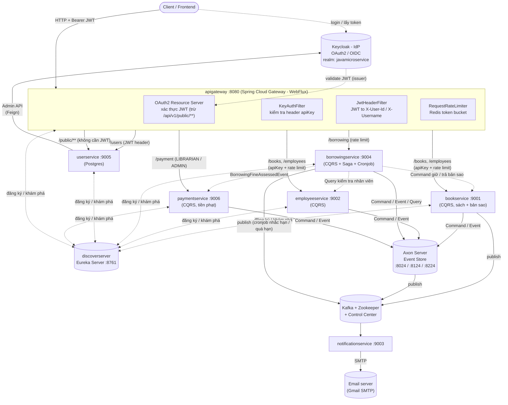
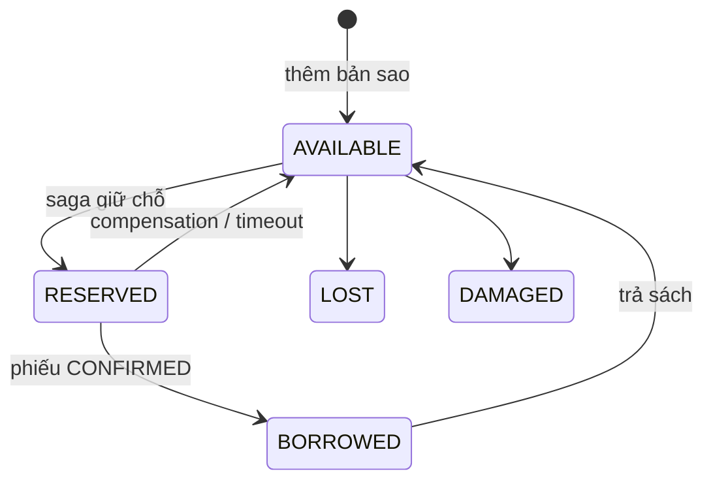
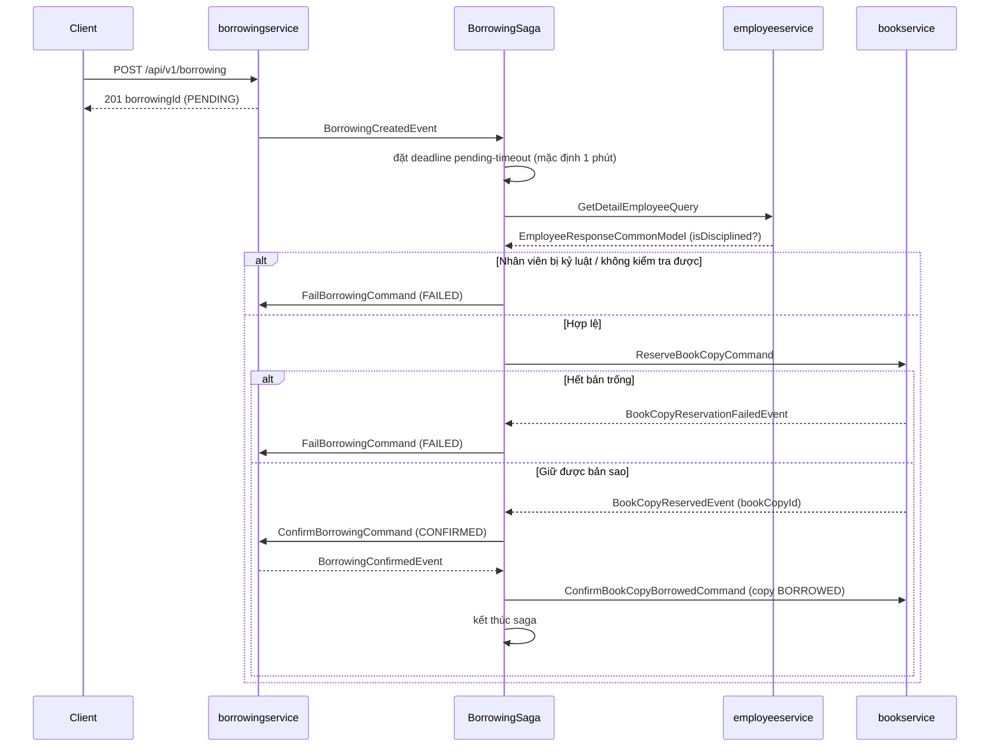
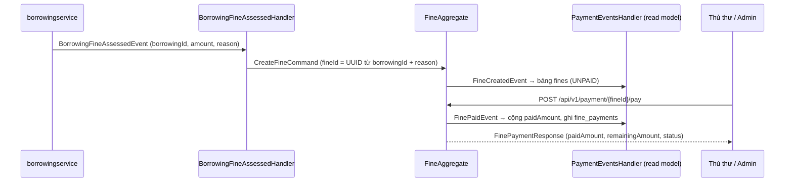

# Java Microservices — Hệ thống Quản lý Thư viện (Library Management)

## 0. Tóm tắt nhanh

| | |
|---|---|
| **Loại dự án** | Microservices Java, mô phỏng nghiệp vụ quản lý thư viện (mượn/trả sách) |
| **Ngôn ngữ / Runtime** | Java 17 |
| **Framework chính** | Spring Boot `4.1.1`, Spring Cloud `2025.1.3` |
| **Số lượng service** | 9 (8 service chạy độc lập + 1 thư viện dùng chung) |
| **Pattern kiến trúc nổi bật** | CQRS, Event Sourcing (Axon Framework), Saga (orchestration), API Gateway, Service Discovery |
| **Xác thực** | OAuth2 / OIDC qua Keycloak, JWT tại Gateway |
| **Message broker** | Apache Kafka (Confluent) |
| **Build / đóng gói** | Maven (Maven Wrapper), Docker, Docker Compose, Kubernetes (bản nháp) |
| **CI/CD** | GitHub Actions → build & push Docker image → SSH deploy lên VPS |

## 1. Tổng quan

Đây là một hệ thống **microservices** viết bằng Java/Spring Boot, mô phỏng nghiệp vụ **quản lý thư viện**: quản lý sách (`bookservice`), quản lý nhân viên (`employeeservice`), quản lý phiếu mượn sách (`borrowingservice`), quản lý tiền phạt và thu tiền phạt (`paymentservice`), quản lý người dùng/xác thực (`userservice`), gửi thông báo email (`notificationservice`), cùng các thành phần hạ tầng dùng chung: service discovery (`discoverserver`), API gateway (`apigateway`) và một thư viện dùng chung (`commonservice`).

Điểm đặc trưng của dự án là áp dụng **CQRS + Event Sourcing** (thông qua Axon Framework) và **Saga pattern** để xử lý giao dịch phân tán khi mượn sách (phải kiểm tra nhân viên có đang bị kỷ luật/khoá hay không, giữ một bản sao còn trống, và trả lại bản sao nếu có lỗi ở bất kỳ bước nào).

Mỗi đầu sách quản lý nhiều **bản sao vật lý** (`BookCopy`: barcode, vị trí kệ, tình trạng, trạng thái `AVAILABLE / RESERVED / BORROWED / LOST / DAMAGED`). Phiếu mượn gắn với đúng một bản sao, có vòng đời `PENDING → CONFIRMED → RETURNED` (hoặc `FAILED` / `CANCELLED`), và nhiều người mượn cùng lúc không bao giờ lấy trùng bản sao (chi tiết: [book-copy-management.md](book-copy-management.md), kịch bản test tay: [BOOK_COPY_API_TEST.md](BOOK_COPY_API_TEST.md)).

Mỗi phiếu mượn có **hạn trả**; một **cronjob** trong `borrowingservice` tự nhắc trước khi đến hạn, báo quá hạn và tính **tiền phạt**, rồi gửi email qua Kafka → `notificationservice` (chi tiết: [BORROWING_REMINDER.md](BORROWING_REMINDER.md)). Khi trả sách muộn, tiền phạt được chốt và chuyển sang `paymentservice` thành một **khoản phạt (Fine)**; thủ thư/admin thu tiền tại đây, cho phép trả nhiều lần (chi tiết: mục 5).

Xác thực/uỷ quyền được tách riêng qua **Keycloak** (OAuth2/OIDC), API Gateway đứng trước để định tuyến, xác thực JWT, giới hạn tốc độ (rate limit) và forward thông tin người dùng xuống các service phía sau.

Xét về mục đích, đây giống một dự án **học tập/thực hành kiến trúc microservices nâng cao** hơn là một sản phẩm production-ready: nó cố tình đưa vào gần như đầy đủ các "món" kinh điển của microservices (discovery, gateway, CQRS, event sourcing, saga, message queue với retry/DLQ, IdP riêng biệt) trên cùng một bài toán nghiệp vụ nhỏ (thư viện), rất phù hợp để đối chiếu lý thuyết với triển khai thực tế.

## 2. Kiến trúc tổng thể



> Sơ đồ trên chỉ mô tả các luồng chính; một vài quan hệ phụ (health-check, Eureka self-preservation…) được lược bỏ cho dễ đọc.

`commonservice` **không phải** là một service chạy độc lập mà là **thư viện dùng chung** (shared library, được các service khác `import` như một Maven dependency): chứa exception chuẩn, `ApiResponse` wrapper, cấu hình Axon/Kafka/Mail, và các command/event/query dùng để giao tiếp chéo giữa `bookservice` ↔ `borrowingservice` ↔ `employeeservice` trong saga.

## 3. Danh sách services

| Service | Cổng | Vai trò | DB | Ghi chú |
|---|---|---|---|---|
| `discoverserver` | 8761 | Service registry (Eureka Server) | — | Không tự đăng ký chính nó vào registry |
| `apigateway` | 8080 | API Gateway / BFF, xác thực, rate-limit | — (Redis) | Spring Cloud Gateway WebFlux |
| `bookservice` | 9001 | Quản lý sách và bản sao (CQRS) | H2 in-memory (`bookDB`) | Aggregate `BookAggregate` giữ toàn bộ bản sao của một đầu sách; read model bảng `book_copies` |
| `employeeservice` | 9002 | Quản lý nhân viên (CQRS) | H2 in-memory (`employeeDB`) | Có Swagger/OpenAPI |
| `notificationservice` | 9003 | Consumer Kafka, gửi email | — | Kafka consumer + Freemarker template (chào mừng, nhắc hạn trả, quá hạn/tiền phạt) |
| `borrowingservice` | 9004 | Quản lý phiếu mượn (CQRS + Saga) | H2 in-memory (`borrowingDB`) | Điều phối `BorrowingSaga` (có timeout qua `DeadlineManager`); cronjob `BorrowingReminderJob` nhắc hạn trả / tính tiền phạt |
| `paymentservice` | 9006 | Quản lý khoản phạt và thu tiền phạt (CQRS + Event Sourcing) | H2 in-memory (`paymentDB`) | Aggregate `FineAggregate`; read model bảng `fines`, `fine_payments`; tự xác thực JWT (resource server) |
| `userservice` | 9005 | Quản lý user, đăng nhập, tích hợp Keycloak | PostgreSQL (`library_local`) | Gọi Keycloak Admin API qua Feign |
| `commonservice` | — | Thư viện dùng chung (không chạy độc lập) | — | Exception, ApiResponse, Axon/Kafka/Mail config |

## 4. Công nghệ sử dụng

### Ngôn ngữ & nền tảng
- **Java 17**
- **Spring Boot** (parent `4.1.1`), **Spring Cloud** `2025.1.3`
- **Maven** (build tool, dùng Maven Wrapper `mvnw`)
- **Lombok** — giảm boilerplate

### Kiến trúc & giao tiếp
- **Spring Cloud Netflix Eureka** — service discovery (client & server)
- **Spring Cloud Gateway (WebFlux, reactive)** — API Gateway
- **OpenFeign** (`spring-cloud-starter-openfeign`) — `userservice` gọi Keycloak Admin REST API (`IdentityClient`)
- **Axon Framework** (`axon-spring-boot-starter` + **Axon Server**) — CQRS, Event Sourcing, Command/Query/Event Gateway, **Saga** (`BorrowingSaga`)
- **Apache Kafka** (Confluent images) + **Spring Kafka** — message broker cho luồng thông báo, có cấu hình **Retryable Topic + Dead Letter Topic (DLT)** với backoff
- **Redis** — backing store cho `RequestRateLimiter` (token bucket) của Gateway

### Bảo mật
- **Keycloak** (`quay.io/keycloak/keycloak:25.0.0`) — Identity Provider (OAuth2/OIDC), realm `javamicroservice`
- **Spring Security OAuth2 Resource Server** (JWT) tại `apigateway` — xác thực token phát hành bởi Keycloak
- Filter tuỳ biến tại Gateway:
  - `KeyAuthFilter` — kiểm tra header `apiKey` tĩnh cho route `/books`, `/employees`
  - `JwtHeaderFilter` — trích `sub`/`preferred_username` từ JWT, gắn vào header `X-User-Id` / `X-Username` khi forward xuống `userservice`
- `userservice` dùng Feign client gọi thẳng Keycloak Admin API để **tạo user**, **đổi token** (client-credentials & password grant)

### Dữ liệu
- **H2 (in-memory)** — DB tạm cho `bookservice`, `employeeservice`, `borrowingservice`, `paymentservice` (mỗi service một DB riêng, có bật H2 console)
- **PostgreSQL** — DB chính thức cho `userservice` (`library_local`)
- **Spring Data JPA** — ORM cho các service có DB quan hệ

### Nhắn tin & thông báo
- **Spring Kafka** — publish/consume sự kiện (topic `test`, `testEmail`, `emailTemplate`, `borrowing-notification`)
- **Spring Scheduling** (`@Scheduled`) — cronjob nhắc hạn trả / báo quá hạn trong `borrowingservice`
- **Spring Boot Starter Mail** + **FreeMarker** — soạn & gửi email (SMTP Gmail), có template `emailTemplate.ftl`

### Khác
- **Google Guava** — dùng ở các service CQRS
- **springdoc-openapi** — Swagger UI cho `employeeservice`
- **H2 Console** — debug DB dev

### Phiên bản image hạ tầng (theo `docker-compose.yml` / `docker-compose-provider.yml`)

| Thành phần | Image | Tag |
|---|---|---|
| Axon Server | `axoniq/axonserver` | `latest` |
| Redis | `redis` | `lastest` ⚠️ *(typo — xem mục 10)* |
| Zookeeper | `confluentinc/cp-zookeeper` | `7.7.0` |
| Kafka broker | `confluentinc/cp-server` | `7.7.0` |
| Kafka Control Center | `confluentinc/cp-enterprise-control-center` | `7.7.0` |
| Keycloak | `quay.io/keycloak/keycloak` | `25.0.0` |

## 5. Kiến trúc CQRS + Event Sourcing + Saga (điểm nhấn của dự án)

Các service nghiệp vụ chính (`bookservice`, `employeeservice`, `borrowingservice`, `paymentservice`) đều tách theo 2 luồng:

- **Command side** (`command/`): `Aggregate` (vd. `BookAggregate`) nhận `Command` → validate → phát ra `Event` → `AggregateLifecycle.apply(event)`. Aggregate tự cập nhật state qua `@EventSourcingHandler`.
- **Query side** (`query/`): `Projection` lắng nghe event để cập nhật read-model, `QueryController` phục vụ truy vấn qua `QueryGateway`.

Tất cả event được lưu tập trung ở **Axon Server** (event store), cho phép replay & tách biệt hoàn toàn ghi/đọc.

### Bảng Command / Event / Query dùng chung xuyên service (định nghĩa trong `commonservice`)

| Loại | Tên | Service phát ra | Service xử lý |
|---|---|---|---|
| Command | `ReserveBookCopyCommand` | `borrowingservice` (saga) | `bookservice` — giữ một bản sao `AVAILABLE` cho phiếu mượn |
| Command | `ConfirmBookCopyBorrowedCommand` | `borrowingservice` (saga) | `bookservice` — chuyển bản sao `RESERVED → BORROWED` |
| Command | `ReleaseBookCopyCommand` | `borrowingservice` (saga) | `bookservice` — trả đúng bản sao phiếu đang giữ về `AVAILABLE` |
| Event | `BookCopyReservedEvent` | `bookservice` | `borrowingservice` (saga) |
| Event | `BookCopyReservationFailedEvent` | `bookservice` | `borrowingservice` (saga) — hết sách |
| Event | `BookCopyBorrowedEvent` | `bookservice` | `bookservice` (read model) |
| Event | `BookCopyReleasedEvent` | `bookservice` | `bookservice` (read model) |
| Event | `BorrowingFineAssessedEvent` | `borrowingservice` (khi trả sách muộn) | `paymentservice` — tạo khoản phạt (`CreateFineCommand`) |
| Query | `GetBookDetailQuery` | `borrowingservice` (projection) | `bookservice` |
| Query | `GetDetailEmployeeQuery` | `borrowingservice` (saga, projection, cronjob) | `employeeservice` |

Các event saga lắng nghe đều mang `borrowingId`, và saga liên kết theo `borrowingId` chứ không theo `bookId`. Nhờ vậy nhiều saga cùng mượn một đầu sách không nhận nhầm event của nhau.

### Quản lý bản sao sách (`bookservice`)

Tài liệu đầy đủ: [book-copy-management.md](book-copy-management.md).

- `BookAggregate` là ranh giới nhất quán của **một đầu sách và toàn bộ bản sao** của nó. Axon xử lý tuần tự mọi command cùng `bookId` (khoá theo aggregate và kiểm tra sequence number khi ghi event), nên khi hai người tranh bản sao cuối cùng chỉ một người giữ được.
- Trạng thái bản sao:



- Quy tắc nghiệp vụ:
  - Tạo sách có thể kèm `initialCopies`; thêm bản sao lẻ qua `POST /books/{bookId}/copies` (barcode trùng trong cùng đầu sách → `409`).
  - Chỉ bản `AVAILABLE` mới được đánh dấu `LOST` / `DAMAGED`. Bản mất / hỏng vẫn tính vào `totalCopies` nhưng không cho mượn.
  - Không xoá được bản sao hoặc đầu sách khi còn bản `RESERVED` / `BORROWED` (`409`).
  - Hết bản trống thì aggregate **không ném exception** mà phát `BookCopyReservationFailedEvent`, để saga chuyển phiếu sang `FAILED`.
  - Saga gửi lại `ReserveBookCopyCommand` cho cùng phiếu thì không giữ thêm bản thứ hai (idempotent). Release chỉ áp dụng cho đúng bản sao mà phiếu đang giữ.
- Read model: bảng `book_copies` (index `book_id, status` và `barcode`). `GET /books/{bookId}` trả `totalCopies`, `availableCopies` và danh sách `copies`; trường `isReady` cũ đã bỏ.

### Saga nghiệp vụ mượn sách (`BorrowingSaga` trong `borrowingservice`)

`POST /api/v1/borrowing` chỉ tạo phiếu ở trạng thái `PENDING` rồi trả về `borrowingId` ngay; saga chạy bất đồng bộ phía sau. Client gọi `GET /api/v1/borrowing/{borrowingId}` để xem phiếu đã `CONFIRMED`, `FAILED` hay `CANCELLED` (kèm `bookCopyId`, `failureReason`).



Diễn giải từng bước:

1. `BorrowingCreatedEvent` → saga đặt deadline timeout, rồi gọi `GetDetailEmployeeQuery` kiểm tra nhân viên **trước** khi giữ sách, nên nhân viên bị khoá không làm giữ bản sao nào.
   - Bị khoá hoặc lỗi khi kiểm tra → `FailBorrowingCommand`.
   - Hợp lệ → `ReserveBookCopyCommand`. Nếu sách không tồn tại / đã xoá thì command lỗi → `FAILED` ("Cannot reserve book ...").
2. `BookCopyReservationFailedEvent` (hết sách) → `FailBorrowingCommand`.
3. `BookCopyReservedEvent` → `ConfirmBorrowingCommand` gắn `bookCopyId` vào phiếu. Nếu xác nhận lỗi → **compensation**: `ReleaseBookCopyCommand` trả bản sao rồi `FailBorrowingCommand`.
4. `BorrowingConfirmedEvent` → `ConfirmBookCopyBorrowedCommand` (bản sao `RESERVED → BORROWED`), kết thúc saga. Nếu bước này lỗi thì không release: bản sao vẫn được giữ cho đúng phiếu này và vẫn trả được khi trả sách.
5. **Timeout**: quá `borrowing.saga.pending-timeout` (mặc định `PT1M`) mà phiếu vẫn `PENDING` → `CancelBorrowingCommand` (`CANCELLED`). Nếu saga đã giữ bản sao thì release; nếu đang chờ kết quả giữ chỗ thì đợi event về rồi mới release và kết thúc, tránh bản sao kẹt ở `RESERVED`.
6. `BorrowingFailedEvent` / `BorrowingCancelledEvent` → kết thúc saga và huỷ deadline.
7. **Trả sách**: `BorrowingReturnedEvent` khởi động một saga ngắn, gửi `ReleaseBookCopyCommand` với đúng `bookCopyId` của phiếu.

Vòng đời phiếu mượn (`BorrowingStatus`): `PENDING → CONFIRMED → RETURNED`, `PENDING → FAILED`, `PENDING → CANCELLED`. Aggregate chặn các thao tác sai trạng thái: chỉ trả được phiếu `CONFIRMED` (trả lần hai hoặc trả phiếu `FAILED` → `409`), `bookId` / `employeeId` khi trả phải khớp phiếu (`400`), API sửa phiếu không cho đổi `bookId` và không cho đặt `returnDate` (phải dùng API trả sách).

Đây là ví dụ **compensating transaction** (Saga orchestration) điển hình cho giao dịch xuyên nhiều service không dùng distributed transaction/2PC: thay vì khoá tài nguyên trên nhiều service cùng lúc, hệ thống chấp nhận trạng thái "tạm thời không nhất quán" (phiếu `PENDING`, bản sao `RESERVED`) rồi tự sửa bằng command bù trừ nếu bước sau thất bại hoặc quá thời gian.

### Hạn trả, quá hạn và tiền phạt (cronjob)

Tài liệu đầy đủ: [BORROWING_REMINDER.md](BORROWING_REMINDER.md).

- Khi tạo phiếu, `dueDate = ngày mượn + 14 ngày` (cấu hình `borrowing.policy.*`).
- `BorrowingReminderJob` (`@Scheduled`, mặc định 8h sáng) quét read-model:
  - **Sắp đến hạn** (trong 2 ngày tới) → `NotifyBorrowingDueSoonCommand` → nhắc **1 lần**.
  - **Quá hạn** → `RecordBorrowingOverdueCommand` → aggregate tính `số ngày trễ × 5.000 VND` → báo **tối đa 1 lần/ngày**.
- Aggregate quyết định có gửi hay không và lưu lại bằng event (`BorrowingDueSoonNotifiedEvent`, `BorrowingOverdueRecordedEvent`), nên chạy lại job hay chạy nhiều instance đều không gửi trùng. Chỉ khi command thành công, job mới publish `BorrowingNotificationMessage` (JSON) lên topic `borrowing-notification`.
- Tiền phạt được **chốt** trong `BorrowingReturnedEvent` khi trả sách. Nếu tiền phạt > 0, aggregate phát thêm `BorrowingFineAssessedEvent` (reason `OVERDUE`) để `paymentservice` tạo khoản phạt.
- `notificationservice` (`BorrowingNotificationConsumer`) render `borrowingDueSoon.ftl` / `borrowingOverdue.ftl` và gửi email tới `email` của nhân viên (trường mới của `employeeservice`). Có retry topic + DLT như các consumer khác.

### Thanh toán tiền phạt (`paymentservice`)

`paymentservice` nhận tiền phạt đã chốt bên `borrowingservice` và quản lý việc thu tiền. Mỗi khoản phạt là một aggregate `FineAggregate` (event sourcing qua Axon Server).



- **Tạo khoản phạt**: `BorrowingFineAssessedHandler` sinh `fineId` cố định bằng `UUID.nameUUIDFromBytes(borrowingId + ":" + reason)`, và `CreateFineCommand` dùng `CREATE_IF_MISSING`. Nhận lại cùng một event (replay, gửi trùng) thì không tạo khoản phạt thứ hai. Bảng `fines` cũng có unique `(borrowing_id, reason)`.
- **Thu tiền** (`PayFineCommand`): cho trả nhiều lần. Aggregate chặn:
  - khoản phạt đã `PAID` / `WAIVED` → `409`;
  - số tiền ≤ 0 hoặc lớn hơn số còn nợ → `400`;
  - `fineId` không tồn tại → `404`.
- Trạng thái (`FineStatus`): `UNPAID → PARTIALLY_PAID → PAID`. `WAIVED` (miễn phạt) đã có trong enum và entity (`waivedAmount`, `waiveReason`, `waivedBy`) nhưng **chưa có command/API**.
- Mỗi lần thu tạo một `paymentId` mới; người thu (`collectedBy`) lấy từ `preferred_username` trong JWT. Phương thức: `CASH`, `CREDIT_CARD`, `DEBIT_CARD`, `BANK_TRANSFER`, `MOBILE_PAYMENT`, `ONLINE`.
- Read model: `fines` (số tiền, `paidAmount`, `waivedAmount`, `currency` mặc định `VND`, `status`, `settledAt`; `remainingAmount` tính khi đọc, không lưu DB) và `fine_payments` (lịch sử từng lần thu). Khi replay event, lần thu đã có trong `fine_payments` sẽ bị bỏ qua để không cộng tiền hai lần.
- Phân quyền: gateway chỉ cho `LIBRARIAN` / `ADMIN` vào `/api/v1/payment/**`. Service cũng tự xác thực JWT (`ResourceServerSecurityConfig`) và kiểm tra role bằng `@PreAuthorize`.

## 6. Chuẩn hoá response & xử lý lỗi

- `commonservice.model.ApiResponse<T>` — wrapper JSON thống nhất cho toàn hệ thống: `statusCode`, `message`, `data` (khi thành công), `error` + `details` (khi lỗi), `timestamp`. Có factory method sẵn: `success()`, `created()`, `notFound()`, `badRequest()`, `conflict()`, `unauthorized()`, `forbidden()`, `error()`.
- `commonservice.advise.ExceptionAdvice` (`@ControllerAdvice`) — bắt lỗi tập trung: validation lỗi (`MethodArgumentNotValidException`), lỗi từ Axon (`HandlerExecutionException`, kèm `ErrorDetail` truyền HTTP status code cụ thể), lỗi bọc trong `CompletionException`/`ExecutionException` khi gọi `queryGateway.query().join()`, và exception nghiệp vụ tuỳ biến (`AppException` và các lớp con: `BadRequestException`, `NotFoundException`, `ConflictException`, `ForbiddenException`, `UnauthorizedException`).
- `userservice` có bộ exception & `GlobalExceptionHandler` riêng tương tự (chưa phụ thuộc `commonservice`).

Ví dụ response thành công:

```json
{
  "statusCode": 200,
  "message": "Get book detail successfully",
  "data": {
    "id": "b1",
    "name": "Clean Architecture",
    "author": "Robert C. Martin",
    "totalCopies": 2,
    "availableCopies": 1,
    "copies": [
      { "id": "c1", "barcode": "BC001", "status": "BORROWED", "location": "Shelf A1", "condition": "New" },
      { "id": "c2", "barcode": null, "status": "AVAILABLE", "location": null, "condition": null }
    ]
  }
}
```

Ví dụ response lỗi (validation):

```json
{
  "statusCode": 400,
  "message": "Validation failed",
  "error": "Bad Request",
  "details": [
    "name: must not be blank"
  ]
}
```

## 7. Danh sách API chính

| Method | Path | Service | Mô tả |
|---|---|---|---|
| POST | `/api/v1/books` | bookservice (command) | Tạo sách, tuỳ chọn `initialCopies` để tạo sẵn N bản sao |
| PUT | `/api/v1/books/{bookId}` | bookservice (command) | Cập nhật sách |
| DELETE | `/api/v1/books/{bookId}` | bookservice (command) | Xoá sách (`409` nếu còn bản sao `RESERVED` / `BORROWED`) |
| POST | `/api/v1/books/{bookId}/copies` | bookservice (command) | Thêm bản sao (`barcode`, `location`, `condition`; barcode trùng → `409`) |
| DELETE | `/api/v1/books/{bookId}/copies/{bookCopyId}` | bookservice (command) | Xoá bản sao (không xoá được bản đang giữ / đang mượn) |
| PATCH | `/api/v1/books/{bookId}/copies/{bookCopyId}/lost` | bookservice (command) | Đánh dấu bản sao bị mất (chỉ bản `AVAILABLE`) |
| PATCH | `/api/v1/books/{bookId}/copies/{bookCopyId}/damaged` | bookservice (command) | Đánh dấu bản sao bị hỏng (chỉ bản `AVAILABLE`) |
| GET | `/api/v1/books` | bookservice (query) | Lấy danh sách sách (kèm `totalCopies`, `availableCopies`) |
| GET | `/api/v1/books/{bookId}` | bookservice (query) | Lấy chi tiết sách kèm danh sách bản sao |
| POST | `/api/v1/books/sendMessage` | bookservice (query) | Test gửi message Kafka |
| POST | `/api/v1/employees` | employeeservice (command) | Tạo nhân viên (có `email` để nhận thông báo) |
| PUT | `/api/v1/employees/{employeeId}` | employeeservice (command) | Cập nhật nhân viên |
| DELETE | `/api/v1/employees/{employeeId}` | employeeservice (command) | Xoá nhân viên |
| GET | `/api/v1/employees?isDisciplined=` | employeeservice (query) | Lấy danh sách nhân viên, lọc theo trạng thái kỷ luật |
| GET | `/api/v1/employees/{employeeId}` | employeeservice (query) | Lấy chi tiết nhân viên |
| POST | `/api/v1/borrowing` | borrowingservice (command) | Tạo phiếu mượn ở trạng thái `PENDING` (kích hoạt saga, tự gán hạn trả) |
| GET | `/api/v1/borrowing/{borrowingId}` | borrowingservice (query) | Xem kết quả phiếu mượn: `status`, `bookCopyId`, `failureReason` (MEMBER chỉ xem phiếu của mình) |
| PATCH | `/api/v1/borrowing/{borrowingId}` | borrowingservice (command) | LIBRARIAN/ADMIN sửa phiếu / gia hạn (`dueDate`); không đổi được `bookId`, không đặt `returnDate` |
| PATCH | `/api/v1/borrowing/{borrowingId}/return` | borrowingservice (command) | Trả sách, release đúng bản sao đã mượn (chốt tiền phạt nếu trả muộn) |
| GET | `/api/v1/borrowing/employeeId/{employeeId}` | borrowingservice (query) | Danh sách phiếu mượn của nhân viên (kèm `dueDate`, `fineAmount`) |
| POST | `/api/v1/borrowing/reminders/run` | borrowingservice (command) | ADMIN chạy ngay cronjob nhắc hạn / báo quá hạn |
| POST | `/api/v1/payment/{fineId}/pay` | paymentservice (command) | LIBRARIAN/ADMIN thu tiền phạt (`amount`, `method`, `referenceCode`, `note`); trả được nhiều lần, không vượt số còn nợ |
| POST | `/api/v1/public/login` | userservice | Đăng nhập (không cần JWT, đi qua Keycloak) |
| POST | `/api/v1/users` | userservice | Tạo user (đăng ký, tạo cả trên Keycloak) |
| GET | `/api/v1/users` | userservice | Lấy danh sách user |
| GET | `/api/v1/users/{id}` | userservice | Lấy chi tiết user |
| PUT | `/api/v1/users/{id}` | userservice | Cập nhật user |
| DELETE | `/api/v1/users/{id}` | userservice | Xoá user |

Mọi API ghi của `bookservice` (sách và bản sao) và mọi API của `paymentservice` chỉ dành cho role `LIBRARIAN` / `ADMIN`. MEMBER chỉ tạo, trả và xem được phiếu mượn của chính mình (theo attribute `employeeId` trên Keycloak).

Tất cả request qua `apigateway` (port `8080`) đều được route dựa trên path và (trừ `/api/v1/public/**`) yêu cầu JWT hợp lệ từ Keycloak; route `/books` và `/employees` còn yêu cầu thêm header `apiKey` hợp lệ. Các route `/books`, `/employees`, `/borrowing`, `/payment` bị giới hạn tốc độ 10 req/s (burst 20) qua Redis.

## 8. Luồng nghiệp vụ end-to-end — ví dụ "mượn sách"

1. Client gọi `POST /api/v1/public/login` (qua gateway → `userservice` → Keycloak) để lấy `access_token`.
2. Client gọi `POST /api/v1/borrowing` kèm `Authorization: Bearer <token>` → gateway xác thực JWT, forward xuống `borrowingservice`.
3. `borrowingservice` tạo `Borrowing` aggregate, phát `BorrowingCreatedEvent` → lưu vào Axon Server.
4. API trả về `borrowingId` ngay (phiếu `PENDING`). `BorrowingSaga` bắt sự kiện, kiểm tra nhân viên ở `employeeservice` rồi giữ một bản sao ở `bookservice` như mô tả ở mục 5; nếu không thoả hoặc quá thời gian chờ, phiếu chuyển `FAILED` / `CANCELLED` và bản sao đã giữ (nếu có) được trả lại.
5. Client gọi `GET /api/v1/borrowing/{borrowingId}` sau 1–2 giây để biết phiếu đã `CONFIRMED` (kèm `bookCopyId`) hay chưa.
6. Khi giao dịch thành công, một service (Book/Notification, tuỳ luồng thực tế) publish message lên Kafka (`testEmail` / `emailTemplate`).
7. Hằng ngày, `BorrowingReminderJob` kiểm tra các phiếu chưa trả: nhắc khi sắp đến hạn, báo quá hạn kèm tiền phạt tạm tính (publish lên topic `borrowing-notification`). Khi trả sách muộn, tiền phạt được chốt vào phiếu mượn và `paymentservice` tạo khoản phạt tương ứng; thủ thư thu tiền qua `POST /api/v1/payment/{fineId}/pay`.
8. `notificationservice` (`EventConsumer`, `BorrowingNotificationConsumer`) tiêu thụ message, render email bằng FreeMarker (`emailTemplate.ftl`) hoặc template inline, gửi qua SMTP Gmail; nếu xử lý lỗi, message được đẩy qua **retry topic** (backoff nhân đôi, tối đa 3 lần retry) rồi cuối cùng vào **Dead Letter Topic (DLT)** nếu vẫn thất bại.

## 9. Hạ tầng & Triển khai

### Docker Compose (`docker-compose.yml` — môi trường dev/CI)
Khởi chạy: `discoverserver`, `bookservice`, `apigateway`, `notificationservice`, `axonserver` (event store), `redis`, `zookeeper` + `broker` (Kafka) + `control-center` (giao diện quản trị Kafka), cùng network bridge `microservice-networks`.

> Compose hiện tại **chưa khai báo** `employeeservice`, `borrowingservice`, `paymentservice`, `userservice` — cần bổ sung service block cho các service này nếu muốn chạy toàn bộ hệ thống chỉ bằng một lệnh `docker compose up`.

### `docker-compose-provider.yml`
Chạy riêng **Keycloak** (`start-dev` mode) — dùng để chuẩn bị Identity Provider trước khi chạy các service cần OAuth2.

### CI/CD (`.github/cicd.yml`, GitHub Actions)
1. **build-and-push**: checkout → login Docker Hub → build & push image (hiện tại chỉ định nghĩa cho `discoverserver` trong file mẫu) bằng `docker compose build/push`.
2. **deployment**: SSH vào server (secrets `SERVER_HOST/USERNAME/KEY/PORT`) và chạy `scripts/deploy.sh`.

### `scripts/deploy.sh`
Script deploy trên VPS: `git fetch/checkout/pull` → `docker compose down` → `docker compose pull` → `docker compose up -d` → `docker system prune -af`.

### Kubernetes (`k8s.deployment.yaml`)
File mẫu (draft), mới định nghĩa Deployment + Service (NodePort) cho `discoveryserver` (3 replicas) và `apigateway` (2 replicas). Chưa đầy đủ cho toàn bộ service còn lại và còn vài lỗi chính tả trong YAML (`targerPort`, `metadate`, `targetPorst`, `app/v1` thay vì `apps/v1`) cần sửa trước khi dùng thật.

## 10. Cách chạy dự án (gợi ý)

```bash
# 1. Khởi động Identity Provider (Keycloak) trước
docker compose -f docker-compose-provider.yml up -d
# → tạo realm "javamicroservice", client, roles tương ứng trên Keycloak UI (http://localhost:8180)

# 2. Build & chạy toàn bộ hạ tầng + service qua Docker Compose
docker compose -f docker-compose.yml up -d --build

# Hoặc chạy từng service ở local (cần discoverserver + axonserver chạy trước):
cd discoverserver && ./mvnw spring-boot:run
cd apigateway && ./mvnw spring-boot:run
cd bookservice && ./mvnw spring-boot:run
# ... tương tự cho các service còn lại
```

Lưu ý: `apigateway`, `commonservice`, `userservice`, `paymentservice` có file `application.yml.example` / `application.properties.example` — cần copy thành `application.yml` / `application.properties` thật và điền giá trị nhạy cảm (client-id/secret Keycloak, DB credentials) trước khi chạy.

## 11. ⚠️ Lưu ý bảo mật & một vài lỗi cấu hình cần xử lý

Trong lúc đọc cấu hình, phát hiện một số vấn đề nên xử lý sớm:

- **Rò rỉ credential thật (nghiêm trọng)**:
  - `commonservice/src/main/resources/application.yml` — chứa **email Gmail thật và mật khẩu ứng dụng (app password)** ở dạng plaintext cho cấu hình SMTP.
  - `apigateway/src/main/resources/application.yml` — chứa **mật khẩu Redis** ở dạng plaintext.
  - Khuyến nghị: thu hồi/đổi ngay các credential trên, gỡ khỏi lịch sử git nếu cần (`git filter-repo`/BFG), và chuyển sang biến môi trường/secret manager — chỉ commit file `.example` như đang làm với `userservice`.
- **`apiKey` tĩnh tại Gateway**: `KeyAuthFilter` so sánh header `apiKey` với một giá trị cấu hình cố định — không xoay vòng (rotate), không phân biệt theo client, dễ bị lộ nếu log request. Cân nhắc thay bằng cơ chế theo client (client id/secret, hoặc chuyển hẳn sang JWT scope) khi lên production.
- **Typo image Redis**: `docker-compose.yml` khai báo `image: redis:lastest` (đúng phải là `latest`) — tag này không tồn tại nên `docker compose pull/up` cho service `redis` sẽ lỗi.
- **File `docker-compose.yml` thiếu service**: chưa có block cho `employeeservice`, `borrowingservice`, `paymentservice`, `userservice` (xem mục 9).
- **`k8s.deployment.yaml` chưa hoàn chỉnh**: nhiều lỗi chính tả field YAML (xem mục 9), thiếu ConfigMap/Secret, thiếu manifest cho phần lớn service.

## 12. Đánh giá nhanh: điểm mạnh & hạn chế

**Điểm mạnh**
- Áp dụng đúng tinh thần CQRS/Event Sourcing với Axon: tách bạch rõ ràng command/query, aggregate/projection theo từng service.
- Saga orchestration xử lý rollback nhiều bước khá mạch lạc, dễ trace qua log; có timeout và compensation để bản sao không bị kẹt ở `RESERVED`.
- Mượn đồng thời an toàn: `BookAggregate` là ranh giới nhất quán của cả đầu sách, nên không bao giờ hai phiếu cùng nhận một bản sao. Logic aggregate có test bằng `AggregateTestFixture` (`BookAggregateTest`, `BorrowingAggregateTest`).
- Có chuẩn hoá response (`ApiResponse`) và xử lý lỗi tập trung nhất quán giữa các service dùng `commonservice`.
- Có sẵn cơ chế retry + Dead Letter Topic cho Kafka consumer — xử lý lỗi message một cách tường minh thay vì nuốt lỗi.
- Tách API Gateway độc lập với rate-limit (Redis) và xác thực JWT tập trung, không để từng service tự lo xác thực.

**Hạn chế / có thể cải tiến thêm**
- Chưa có **Config Server** tập trung (Spring Cloud Config) — mỗi service tự quản `application.properties/yml`, dễ lệch cấu hình giữa các môi trường.
- Chưa có **circuit breaker / resilience** (vd. Resilience4j) cho các lời gọi liên service (Feign, QueryGateway) — một service chậm/lỗi có thể làm nghẽn saga.
- Chưa có **distributed tracing** (Zipkin/Sleuth hoặc OpenTelemetry) — khó theo dõi một request xuyên nhiều service khi debug ở môi trường thật.
- Deadline timeout của saga dùng `SimpleDeadlineManager` (lưu trong bộ nhớ): restart `borrowingservice` thì các deadline đang chờ bị mất, phiếu `PENDING` khi đó có thể không tự `CANCELLED`. Cần deadline manager bền vững (vd. JobRunr, Quartz, hoặc DB-backed) khi chạy thật.
- Nhánh compensation "giữ được bản sao nhưng xác nhận phiếu lỗi" trong `BorrowingSaga` chưa có test tự động và không tái hiện được qua API.
- `BookAggregate` chứa toàn bộ bản sao của một đầu sách: đầu sách có rất nhiều bản sao / lượt mượn sẽ có event stream dài, nên cân nhắc bật snapshot.
- H2 in-memory cho các service CQRS phù hợp để demo nhưng **mất dữ liệu khi restart** — cần DB thật (Postgres/MySQL) nếu triển khai thật.
- Một số cấu hình còn hard-code `localhost` (Eureka defaultZone, Redis host) — cần tham số hoá đầy đủ qua biến môi trường cho từng môi trường deploy.
- `paymentservice` mới có phía command: **chưa có API đọc** (danh sách khoản phạt theo nhân viên / theo phiếu mượn, lịch sử thu tiền), nên thủ thư chưa có cách tra `fineId` qua API. Chưa có API miễn phạt (`WAIVED`) và chưa có test `AggregateTestFixture` cho `FineAggregate`.
- Khoản phạt chỉ được tạo khi trả sách muộn: sách mất / hỏng (`FineReason.LOST`, `DAMAGED`) hoặc phiếu quá hạn mà chưa trả thì chưa phát sinh khoản phạt nào.
- Nếu `BorrowingFineAssessedHandler` lỗi (vd. `reason` không khớp `FineReason`), error handler mặc định của Axon chỉ log rồi bỏ qua event, nên khoản phạt có thể bị mất mà không ai biết.
- Manifest Kubernetes và `docker-compose.yml` chưa đồng bộ với danh sách service thực tế (xem mục 11).

## 13. Thuật ngữ nhanh (Glossary)

| Thuật ngữ | Giải thích ngắn gọn |
|---|---|
| **CQRS** | Command Query Responsibility Segregation — tách luồng ghi (Command) và luồng đọc (Query) thành hai mô hình riêng. |
| **Event Sourcing** | Lưu trạng thái dưới dạng chuỗi sự kiện (event) thay vì chỉ lưu trạng thái cuối cùng; có thể replay lại toàn bộ lịch sử. |
| **Aggregate** | Đơn vị nghiệp vụ chịu trách nhiệm nhận Command, đảm bảo tính nhất quán, và phát Event (trong Axon: `@Aggregate`). |
| **Saga** | Pattern xử lý giao dịch xuyên nhiều service bằng một chuỗi bước + command bù trừ (compensating transaction) thay vì transaction phân tán (2PC). |
| **Compensation** | Command bù trừ để huỷ tác dụng của một bước đã làm khi bước sau thất bại (vd. `ReleaseBookCopyCommand` trả bản sao đã giữ). |
| **Deadline** | Hẹn giờ của Axon gắn với saga/aggregate; hết hạn thì gọi `@DeadlineHandler` (dùng cho timeout phiếu `PENDING`). |
| **Projection** | Read-model được cập nhật từ event, phục vụ cho truy vấn (Query side của CQRS). |
| **Eureka** | Service registry của Netflix OSS — nơi các service đăng ký & tra cứu địa chỉ lẫn nhau. |
| **API Gateway** | Điểm vào duy nhất cho client, lo định tuyến, xác thực, rate-limit trước khi vào các service nội bộ. |
| **Axon Server** | Event store + message routing (command/query/event bus) trung tâm cho các ứng dụng dùng Axon Framework. |
| **OAuth2 / OIDC** | Chuẩn xác thực/uỷ quyền; Keycloak đóng vai trò Identity Provider (IdP) phát hành JWT. |
| **DLT (Dead Letter Topic)** | Topic Kafka chứa các message xử lý thất bại sau khi đã retry hết số lần cho phép. |

## 14. Cấu trúc thư mục cấp cao

```
codes/
├── apigateway/          # Spring Cloud Gateway, OAuth2, rate limit
├── bookservice/         # CQRS: quản lý sách
├── borrowingservice/    # CQRS + Saga: quản lý phiếu mượn + cronjob nhắc hạn / tiền phạt
├── commonservice/       # Thư viện dùng chung (exception, ApiResponse, Axon/Kafka/Mail config)
├── discoverserver/      # Eureka Server
├── employeeservice/     # CQRS: quản lý nhân viên
├── notificationservice/ # Kafka consumer + gửi email
├── paymentservice/      # CQRS: khoản phạt + thu tiền phạt
├── userservice/         # Quản lý user + tích hợp Keycloak (Postgres)
├── docker/              # Config bổ sung cho kafka, keycloak
├── scripts/deploy.sh    # Script deploy trên VPS qua SSH
├── RBAC.md              # Tài liệu phân quyền theo vai trò (Keycloak)
├── BORROWING_REMINDER.md # Tài liệu hạn trả, quá hạn, tiền phạt (cronjob)
├── book-copy-management.md # Đặc tả quản lý bản sao sách + saga mượn / trả
├── BOOK_COPY_API_TEST.md   # Kịch bản test tay API bản sao sách
├── docker-compose.yml           # Compose môi trường chính (app + Axon + Kafka + Redis)
├── docker-compose-provider.yml  # Compose riêng cho Keycloak
├── k8s.deployment.yaml          # Manifest K8s mẫu (chưa đầy đủ)
└── .github/cicd.yml             # GitHub Actions CI/CD
```
