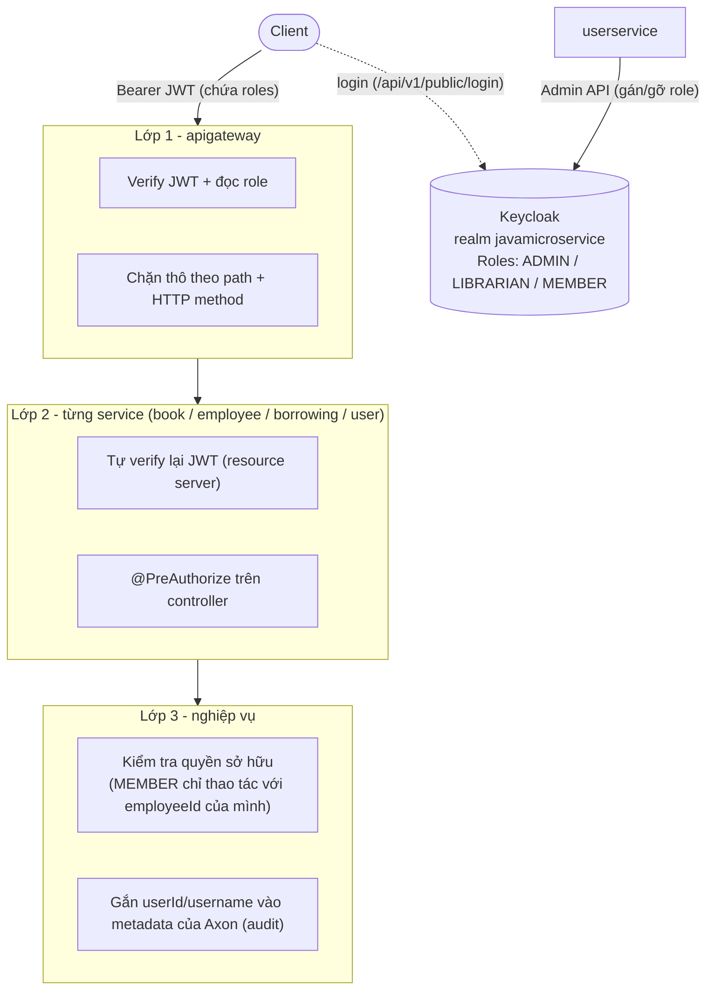
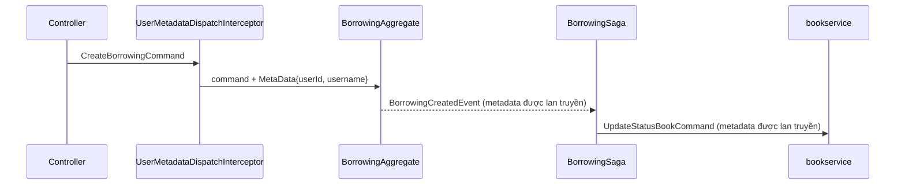

# Phân quyền theo vai trò (RBAC) với Keycloak

Tài liệu mô tả tính năng phân quyền theo vai trò (Role-Based Access Control) trong hệ thống Library Management. Nội dung gồm cách thiết kế, cách cấu hình Keycloak, những gì đã thay đổi trong code, cách chạy và cách kiểm thử.

> Đọc kèm [PROJECT_OVERVIEW.md](PROJECT_OVERVIEW.md) để nắm kiến trúc tổng thể của dự án.

## 1. Tóm tắt

| | |
|---|---|
| **Nơi lưu role** | Keycloak (realm `javamicroservice`). Không lưu role trong database của service |
| **Role nghiệp vụ** | `ADMIN`, `LIBRARIAN`, `MEMBER` |
| **Cách mang role** | Nằm trong access token (JWT), ở claim `roles` và `realm_access.roles` |
| **Nơi kiểm tra quyền** | 3 lớp: API Gateway → từng service (`@PreAuthorize`) → kiểm tra quyền sở hữu trong nghiệp vụ |
| **Thay thế** | `KeyAuthFilter` (header `apiKey` cố định) không còn được dùng trong các route |

## 2. Kiến trúc



**Tại sao phải kiểm tra ở cả 3 lớp?**

- **Gateway** chặn sớm các request rõ ràng không đủ quyền, không để chúng đi tới service phía sau.
- **Service** vẫn phải tự verify JWT. Nếu có ai gọi thẳng vào port của service (9001, 9002…) mà không qua gateway, service vẫn chặn được. Nói cách khác, không service nào mặc định tin tưởng request tới nó (zero-trust).
- **Lớp nghiệp vụ** xử lý những luật mà path/role không diễn đạt được, ví dụ "chỉ được trả sách của chính mình".

Các command nội bộ của `BorrowingSaga` (`UpdateStatusBookCommand`, `RollBackBookStatusCommand`…) đi qua Axon, không đi qua HTTP. Vì vậy chúng **không bị ảnh hưởng** bởi phần kiểm tra quyền, và không được đặt kiểm tra quyền trong aggregate.

## 3. Role và ma trận quyền

| Role | Ý nghĩa |
|---|---|
| `ADMIN` | Toàn quyền: quản lý user, nhân viên, gán role |
| `LIBRARIAN` | Quản lý sách, xem nhân viên, thao tác phiếu mượn của bất kỳ ai |
| `MEMBER` | Xem sách, mượn/trả sách của chính mình. Được gán mặc định cho user mới |

| API | ADMIN | LIBRARIAN | MEMBER |
|---|:-:|:-:|:-:|
| `GET /api/v1/books/**` | ✅ | ✅ | ✅ |
| `POST/PUT/DELETE /api/v1/books/**` | ✅ | ✅ | ❌ |
| `POST /api/v1/books/sendMessage` | ✅ | ❌ | ❌ |
| `GET /api/v1/employees/**` | ✅ | ✅ | ❌ |
| `POST/PUT/DELETE /api/v1/employees/**` | ✅ | ❌ | ❌ |
| `POST /api/v1/borrowing` | ✅ | ✅ | ✅ (chỉ với `employeeId` của mình) |
| `PATCH /api/v1/borrowing/{id}/return` | ✅ | ✅ | ✅ (chỉ với `employeeId` của mình) |
| `PATCH /api/v1/borrowing/{id}` (sửa phiếu) | ✅ | ✅ | ❌ |
| `GET /api/v1/users/me` | ✅ | ✅ | ✅ |
| `/api/v1/users/**` (CRUD, gán role) | ✅ | ❌ | ❌ |
| `GET /api/v1/roles` | ✅ | ❌ | ❌ |
| `/api/v1/public/**` (login, refresh-token) | không cần đăng nhập | | |

> Một user có thể mang nhiều role, ví dụ `LIBRARIAN` + `MEMBER`. Quyền của user là **hợp** của quyền từ tất cả role đó.

## 4. Cấu hình Keycloak

Làm trên Admin Console http://localhost:8180, trong realm **`javamicroservice`** (không làm trên realm `master`).

| # | Việc cần làm | Vị trí trên Admin Console |
|---|---|---|
| 1 | Tạo 3 realm role `ADMIN`, `LIBRARIAN`, `MEMBER` | **Realm roles → Create role** |
| 2 | Gán `MEMBER` làm role mặc định cho user mới | **Realm roles → `default-roles-javamicroservice` → Assign role → `MEMBER`**. Cách khác: **Realm settings → tab User registration** (bấm `>` để cuộn thanh tab) |
| 3 | *(Nên làm)* Tạo group `admins`, `librarians`, `members` và gán role cho từng group | **Groups → Create group → Role mapping** |
| 4 | Bật cho client `library-app`: Client authentication, Direct access grants, Service accounts roles | **Clients → library-app → Settings → Capability config** |
| 5 | Cấp quyền Admin API cho service account: `manage-users`, `view-users`, `query-users`, `view-realm` (thuộc client `realm-management`) | **Clients → library-app → Service accounts roles → Assign role → Filter by clients** |
| 6 | Tạo mapper **User Realm Role**: Token Claim Name = `roles`, Multivalued = On, Add to access token = On | **Clients → library-app → Client scopes → `library-app-dedicated` → Add mapper → By configuration** |
| 7 | Khai báo attribute `employeeId` (chỉ Admin sửa được), rồi tạo mapper **User Attribute** `employeeId` → claim `employeeId` | **Realm settings → User profile → Create attribute**, sau đó làm như bước 6 |
| 8 | Để access token sống ngắn (5–15 phút) | **Realm settings → Tokens → Access Token Lifespan** |
| 9 | Tạo user test, gán group/role và điền `employeeId` | **Users → Add user → Credentials / Groups / Attributes** |

Kiểm tra token: **Clients → library-app → Client scopes → Evaluate → chọn user → Generated access token**. Token hợp lệ trông như sau:

```json
{
  "sub": "419f78c5-efce-4ab5-b59b-21f156d3d0c8",
  "preferred_username": "user02",
  "roles": ["LIBRARIAN", "default-roles-javamicroservice", "offline_access", "uma_authorization", "MEMBER"],
  "realm_access": { "roles": ["LIBRARIAN", "..."] },
  "employeeId": "e1"
}
```

> `default-roles-…`, `offline_access`, `uma_authorization` là role có sẵn của Keycloak. Code bỏ qua các role này.

## 5. Chi tiết triển khai

### 5.1. Chuyển role của Keycloak thành quyền của Spring

Spring Security mặc định chỉ đọc claim `scope`. Vì vậy mỗi nơi verify JWT đều cần một converter:

1. Đọc claim `roles`. Nếu không có thì đọc `realm_access.roles`.
2. Thêm tiền tố `ROLE_` vào từng role, ví dụ `LIBRARIAN` → `ROLE_LIBRARIAN`. Nhờ vậy `hasRole('LIBRARIAN')` mới hoạt động.
3. Lấy principal name từ `preferred_username`.

Converter có ở 3 nơi, vì gateway chạy WebFlux còn `userservice` không phụ thuộc `commonservice`:

| Nơi | File |
|---|---|
| Gateway (reactive) | [apigateway/.../SecurityConfig.java](apigateway/src/main/java/com/javamicroservices/apigateway/Configuration/SecurityConfig.java) |
| Service dùng `commonservice` | [commonservice/.../KeycloakRoleConverter.java](commonservice/src/main/java/com/javamicroservices/commonservice/security/KeycloakRoleConverter.java) |
| userservice | [userservice/.../SecurityConfig.java](userservice/src/main/java/com/javamicroservices/userservice/configuration/SecurityConfig.java) |

### 5.2. Lớp 1: API Gateway

Luật được khai báo theo path + method trong `SecurityWebFilterChain`:

```java
.pathMatchers("/api/v1/public/**").permitAll()
.pathMatchers(HttpMethod.GET, "/api/v1/books/**").authenticated()
.pathMatchers("/api/v1/books/**").hasAnyRole(LIBRARIAN, ADMIN)
.pathMatchers(HttpMethod.GET, "/api/v1/employees/**").hasAnyRole(LIBRARIAN, ADMIN)
.pathMatchers("/api/v1/employees/**").hasRole(ADMIN)
.pathMatchers("/api/v1/borrowing/**").authenticated()   // chi tiết do borrowingservice kiểm tra
.pathMatchers("/api/v1/users/me").authenticated()
.pathMatchers("/api/v1/users/**", "/api/v1/roles/**").hasRole(ADMIN)
.anyExchange().authenticated()
```

Thay đổi trong `application.yml`:
- Bỏ `KeyAuthFilter` khỏi route `employeeservice`, `bookservice`, `borrowingservice`.
- Route `userservice` nhận thêm path `/api/v1/roles/**`.

Gateway mặc định chuyển tiếp nguyên header `Authorization` xuống service phía sau, nên service nhận được token để tự verify.

### 5.3. Lớp 2: Security dùng chung trong `commonservice`

Package [commonservice/.../security/](commonservice/src/main/java/com/javamicroservices/commonservice/security/):

| Class | Vai trò |
|---|---|
| `ResourceServerSecurityConfig` | `SecurityFilterChain` stateless, verify JWT, bật `@EnableMethodSecurity`. Các path `/h2-console/**`, `/swagger-ui/**`, `/v3/api-docs/**`, `/actuator/health` được mở. Lỗi 401/403 ở tầng filter được trả theo format `ApiResponse` |
| `SecurityExceptionAdvice` | Bắt `AccessDeniedException` (ném ra khi `@PreAuthorize` từ chối) và trả **403**. Có `@Order(HIGHEST_PRECEDENCE)` để chạy trước handler `Exception` chung của `ExceptionAdvice`; nếu không, lỗi này sẽ thành 500 |
| `KeycloakRoleConverter` | Chuyển role trong JWT thành `ROLE_xxx` |
| `SecurityUtils` | Helper: `currentUserId()`, `currentUsername()`, `currentEmployeeId()`, `hasAnyRole(...)` |
| `Roles` | Hằng số tên role |
| `UserMetadataDispatchInterceptor` | Gắn `userId` và `username` vào MetaData của mọi command gửi từ REST controller |
| `AxonSecurityConfig` | Khai báo `CorrelationDataProvider` để metadata lan từ command sang event, rồi sang các command do saga gửi |

**Cơ chế bật/tắt:** trong `commonservice`, dependency `spring-boot-starter-oauth2-resource-server` được khai báo là `optional`. Các class trên có `@ConditionalOnClass`, nên chỉ được kích hoạt ở service **tự khai báo lại** dependency đó (book, employee, borrowing). `notificationservice` không khai báo nên không bị ảnh hưởng.

**Cách service nạp các class này:**
- `bookservice`, `employeeservice`: đã `@ComponentScan("com.javamicroservices.commonservice")` nên tự nạp.
- `borrowingservice`: nạp tường minh bằng `@Import` trong [BorrowingserviceApplication.java](borrowingservice/src/main/java/com/javamicroservices/borrowingservice/BorrowingserviceApplication.java).

### 5.4. Phân quyền ở controller

```java
// BookCommandController, áp dụng cho cả class
@PreAuthorize("hasAnyRole('LIBRARIAN','ADMIN')")

// BookQueryController#sendMessage
@PreAuthorize("hasRole('ADMIN')")

// EmployeeCommandController / EmployeeQueryController
@PreAuthorize("hasRole('ADMIN')")  /  @PreAuthorize("hasAnyRole('LIBRARIAN','ADMIN')")

// BorrowingCommandController#updateBorrowing
@PreAuthorize("hasAnyRole('LIBRARIAN','ADMIN')")
```

### 5.5. Lớp 3: Kiểm tra quyền sở hữu khi mượn/trả sách

Trong [BorrowingCommandController.java](borrowingservice/src/main/java/com/javamicroservices/borrowingservice/command/controller/BorrowingCommandController.java), `createBorrowing` và `returnBorrowing` gọi `checkEmployeeOwnership(employeeId)`:

```text
Có role LIBRARIAN hoặc ADMIN          → cho qua (thao tác hộ người khác được)
Token không có claim employeeId       → 403 "Your account is not linked to any employee"
employeeId trong token ≠ trong body   → 403 "You can only borrow or return books for yourself"
```

Khi trả sách, `BorrowingAggregate` vốn đã kiểm tra `employeeId` phải khớp với phiếu mượn. Kết hợp với kiểm tra ở controller, `MEMBER` chỉ trả được phiếu mượn của chính mình.

### 5.6. Audit qua Axon metadata



- Metadata được lưu cùng event trong Axon Server, nên có thể biết ai đã tạo hay trả một phiếu mượn.
- Axon sẽ bỏ `MessageOriginProvider` mặc định nếu có bean `CorrelationDataProvider` khác, nên `AxonSecurityConfig` khai báo lại nó để giữ `correlationId`/`traceId`.
- Interceptor và CorrelationDataProvider nằm ở **2 class riêng**. Để chung một class sẽ gây vòng phụ thuộc (circular dependency) `CorrelationDataProvider → CommandGateway` khi Axon khởi tạo.

### 5.7. userservice: API quản lý role

`userservice` giờ cũng là resource server. Nó gọi Keycloak Admin API bằng Feign ([IdentityClient.java](userservice/src/main/java/com/javamicroservices/userservice/repository/IdentityClient.java)), dùng token `client_credentials` của service account.

| Method | Path | Quyền | Keycloak Admin API tương ứng |
|---|---|---|---|
| GET | `/api/v1/users/me` | đã đăng nhập | — (tìm user trong DB theo `sub` của token) |
| GET | `/api/v1/roles` | ADMIN | `GET /admin/realms/javamicroservice/roles` |
| GET | `/api/v1/users/{id}/roles` | ADMIN | `GET .../users/{kcId}/role-mappings/realm` |
| POST | `/api/v1/users/{id}/roles` | ADMIN | `POST .../users/{kcId}/role-mappings/realm` |
| DELETE | `/api/v1/users/{id}/roles` | ADMIN | `DELETE .../users/{kcId}/role-mappings/realm` |

- `{id}` là id của user trong Postgres. Service tự tra ra `userId` tương ứng bên Keycloak.
- Chỉ cho gán/gỡ `ADMIN`, `LIBRARIAN`, `MEMBER`. Role khác bị trả **400**.
- Body của POST/DELETE:

```json
{ "roles": ["LIBRARIAN"] }
```

- Response trả về danh sách role nghiệp vụ **sau khi** đã thay đổi.

## 6. Cấu hình

Mỗi service cần biết issuer để verify JWT:

```properties
# bookservice / employeeservice / borrowingservice - application.properties
spring.security.oauth2.resourceserver.jwt.issuer-uri=http://localhost:8180/realms/javamicroservice
```

```yaml
# apigateway / userservice - application.yml
spring:
  security:
    oauth2:
      resourceserver:
        jwt:
          issuer-uri: http://localhost:8180/realms/javamicroservice
```

> `application.yml` của `apigateway` và `userservice` không được commit. Đã cập nhật file `.example` tương ứng; nếu tạo lại từ `.example`, nhớ giữ khối cấu hình trên.
>
> Khi chạy bằng Docker, đổi `localhost:8180` thành hostname của container Keycloak. Giá trị này **phải khớp** với claim `iss` trong token, nếu không mọi request đều bị 401.

## 7. Cách chạy

```bash
# 1. Hạ tầng: Keycloak, Axon Server, Kafka, Redis, Postgres
docker compose -f docker-compose-provider.yml up -d
docker compose -f docker-compose.yml up -d

# 2. BẮT BUỘC: cài commonservice vào local Maven repo trước (có package security mới)
cd commonservice && ./mvnw clean install -DskipTests && cd ..

# 3. Chạy các service (discoverserver chạy trước)
cd discoverserver   && ./mvnw spring-boot:run
cd apigateway       && ./mvnw spring-boot:run
cd userservice      && ./mvnw spring-boot:run
cd bookservice      && ./mvnw spring-boot:run
cd employeeservice  && ./mvnw spring-boot:run
cd borrowingservice && ./mvnw spring-boot:run
```

> Mỗi lần sửa `commonservice`, phải `install` lại rồi restart các service dùng nó.

## 8. Kiểm thử

### 8.1. Lấy token

```bash
TOKEN=$(curl -s -X POST http://localhost:8080/api/v1/public/login \
  -H "Content-Type: application/json" \
  -d '{"username":"user02","password":"<password>"}' | jq -r '.data.access_token')
```

### 8.2. Kịch bản

| Kịch bản | Request | Kết quả mong đợi |
|---|---|---|
| Không có token | `GET /api/v1/books` | **401** |
| Token sai hoặc hết hạn | `GET /api/v1/books` + `Bearer abc` | **401** |
| MEMBER xem sách | `GET /api/v1/books` | **200** |
| MEMBER tạo sách | `POST /api/v1/books` | **403** |
| LIBRARIAN tạo sách | `POST /api/v1/books` | **201** |
| MEMBER xem nhân viên | `GET /api/v1/employees` | **403** |
| MEMBER chưa gắn `employeeId` mượn sách | `POST /api/v1/borrowing` | **403** "Your account is not linked to any employee" |
| MEMBER mượn sách hộ người khác | `POST /api/v1/borrowing` với `employeeId` khác của mình | **403** "You can only borrow or return books for yourself" |
| MEMBER mượn sách cho mình | `POST /api/v1/borrowing` với `employeeId` của mình | **201** |
| LIBRARIAN mượn sách hộ | `POST /api/v1/borrowing` với `employeeId` bất kỳ | **201** |
| Gọi thẳng service, không token | `GET http://localhost:9001/api/v1/books` | **401** (service tự chặn) |
| Xem thông tin của mình | `GET /api/v1/users/me` | **200** (404 nếu user không có trong DB) |
| MEMBER quản lý user | `GET /api/v1/users` | **403** |
| ADMIN gán role | `POST /api/v1/users/{id}/roles` `{"roles":["LIBRARIAN"]}` | **200**, trả về danh sách role mới |
| Login | `POST /api/v1/public/login` | không cần token |

Ví dụ:

```bash
curl -i http://localhost:8080/api/v1/books -H "Authorization: Bearer $TOKEN"

curl -i -X POST http://localhost:8080/api/v1/users/1/roles \
  -H "Authorization: Bearer $ADMIN_TOKEN" -H "Content-Type: application/json" \
  -d '{"roles":["LIBRARIAN"]}'
```

Response lỗi có format thống nhất:

```json
{ "statusCode": 403, "message": "You do not have permission to perform this action", "error": "Forbidden" }
```

> Gateway (lớp 1) và các service (lớp 2) đều trả lỗi 401/403 theo cùng format trên. Gateway dùng `authenticationEntryPoint` và `accessDeniedHandler` trong [SecurityConfig.java](apigateway/src/main/java/com/javamicroservices/apigateway/Configuration/SecurityConfig.java).

## 9. Lưu ý và hạn chế

- **Thay đổi role không có hiệu lực ngay.** Token cũ vẫn mang role cũ cho tới khi hết hạn. User cần login lại hoặc gọi `/api/v1/public/refresh-token`.
- **Lỗi 400 có thể xuất hiện trước lỗi 403.** Spring validate `@Valid @RequestBody` trước khi `@PreAuthorize` chạy. User không đủ quyền nhưng gửi body sai sẽ nhận 400. Qua gateway thì trường hợp này đã bị chặn từ lớp 1.
- **`POST /api/v1/users` giờ chỉ ADMIN gọi được.** Nếu muốn người dùng tự đăng ký, tách thành `/api/v1/public/register`.
- **Không còn dùng `apiKey`.** Header `apiKey` được bỏ qua. Class `KeyAuthFilter` vẫn còn trong code nhưng không route nào dùng, có thể xoá.
- **`deleteUser` chỉ xoá user trong Postgres**, chưa xoá bên Keycloak (hành vi cũ, chưa thay đổi).
- **Route `userservice` vẫn trỏ cứng `http://localhost:9005`**, chưa dùng `lb://userservice`.

## 10. Danh sách file thay đổi

**Mới**

| File | Mô tả |
|---|---|
| `commonservice/.../security/ResourceServerSecurityConfig.java` | Filter chain verify JWT dùng chung |
| `commonservice/.../security/SecurityExceptionAdvice.java` | `AccessDeniedException` → 403 |
| `commonservice/.../security/KeycloakRoleConverter.java` | Role Keycloak → `ROLE_xxx` |
| `commonservice/.../security/SecurityUtils.java` | Lấy thông tin user hiện tại |
| `commonservice/.../security/Roles.java` | Hằng số tên role |
| `commonservice/.../security/UserMetadataDispatchInterceptor.java` | Gắn userId/username vào command |
| `commonservice/.../security/AxonSecurityConfig.java` | Lan truyền metadata qua event/saga |
| `userservice/.../configuration/SecurityConfig.java` | Resource server cho userservice |
| `userservice/.../controller/RoleController.java` | `GET /api/v1/roles` |
| `userservice/.../dto/RoleAssignmentRequestDTO.java` | Body cho API gán/gỡ role |
| `userservice/.../dto/identity/RoleRepresentation.java` | Role theo format của Keycloak |

**Sửa**

| File | Mô tả |
|---|---|
| `apigateway/.../SecurityConfig.java` | Converter role + luật theo path/method |
| `apigateway/.../application.yml(.example)` | Bỏ `KeyAuthFilter`, thêm route `/api/v1/roles/**`, thêm issuer-uri |
| `commonservice/pom.xml` | Thêm dependency resource server (`optional`) |
| `bookservice`, `employeeservice`, `borrowingservice` `pom.xml` | Thêm `spring-boot-starter-oauth2-resource-server` |
| `bookservice`, `employeeservice`, `borrowingservice` `application.properties` | Thêm `issuer-uri` |
| `BookCommandController`, `BookQueryController` | `@PreAuthorize` |
| `EmployeeCommandController`, `EmployeeQueryController` | `@PreAuthorize` |
| `BorrowingCommandController` | `@PreAuthorize` + kiểm tra quyền sở hữu |
| `BorrowingserviceApplication` | `@Import` các class security |
| `userservice/pom.xml`, `application.yml.example` | Resource server + issuer-uri |
| `UserController` | `@PreAuthorize`, `/me`, API role |
| `IUserService`, `UserServiceImpl` | Logic role, `getCurrentUser`, tách hàm `adminAccessToken()` |
| `IdentityClient` | Thêm 4 endpoint role-mapping của Keycloak Admin API |
| `GlobalExceptionHandler` (userservice) | `AccessDeniedException` → 403 |
